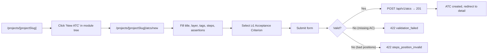
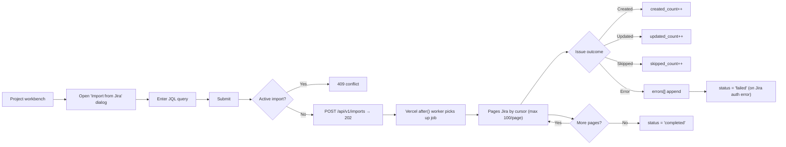
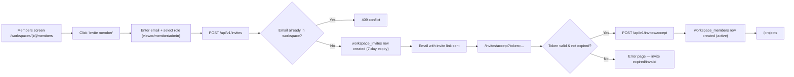
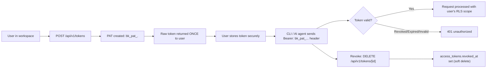
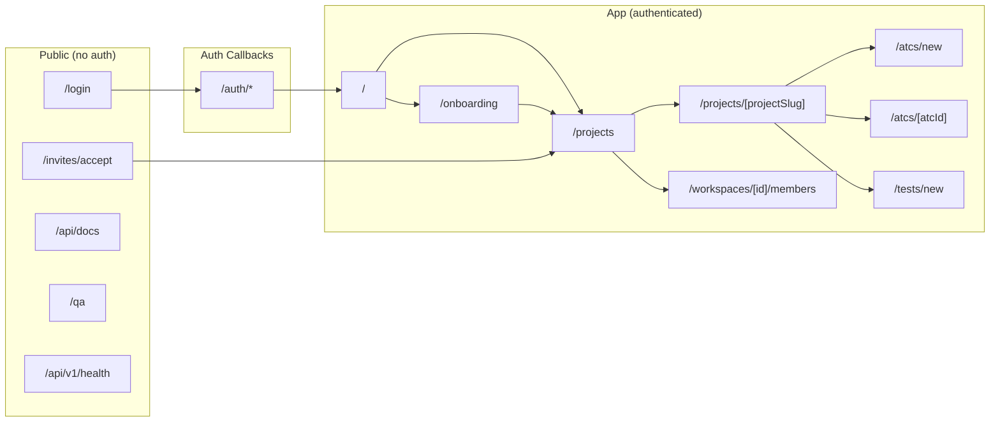

# User Journeys — Bunkai TMS

> Generated: 2026-06-23
> Source: App Router `page.tsx` files, `middleware.ts`, redirect logic, component analysis.

---

## 1. Route Map

### Public Routes (Unauthenticated)

| Route | Page | Purpose |
|-------|------|---------|
| `/login` | `app/(auth)/login/page.tsx` | Magic-link sign-in; disabled GitHub/Google OAuth buttons |
| `/auth/*` | `app/auth/` | Supabase Auth callback handler (session bootstrap) |
| `/invites/accept` | `app/invites/accept/page.tsx` | Workspace invite redemption (token via query param) |
| `/api/docs` | `app/api/docs/page.tsx` | Scalar API reference viewer |
| `/api/openapi` | `app/api/openapi/route.ts` | OpenAPI JSON spec (force-static, public) |
| `/api/v1/health` | `app/api/v1/health/route.ts` | Service liveness probe (public) |
| `/qa` | `app/qa/page.tsx` | Software Testability Guide (public, no auth) |
| `/design-tokens` | `app/design-tokens/` | Design token reference (developer utility) |

### Protected Routes (Authenticated)

| Route | Page | Requires (role) | Purpose |
|-------|------|-----------------|---------|
| `/onboarding` | `app/(app)/onboarding/page.tsx` | Authenticated, no workspace yet | Workspace creation on first login |
| `/projects` | `app/(app)/projects/page.tsx` | Any active member | Project list |
| `/projects/[projectSlug]` | `app/(app)/projects/[projectSlug]/page.tsx` | Active member of owning workspace | Project workbench (module tree + ATCs) |
| `/projects/[projectSlug]/atcs/new` | `app/(app)/projects/[projectSlug]/atcs/new/` | member+ | New ATC form |
| `/projects/[projectSlug]/atcs/[atcId]` | `app/(app)/projects/[projectSlug]/atcs/[atcId]/` | Active member | ATC detail pane |
| `/projects/[projectSlug]/tests/new` | `app/(app)/projects/[projectSlug]/tests/new/` | member+ | New Test chain form |
| `/workspaces/[id]/members` | `app/(app)/workspaces/[id]/members/` | admin+ | Member management screen |

Source: `middleware.ts` lines 8–9 (`PROTECTED_PREFIXES = ['/projects', '/onboarding']`).

Note: Middleware guards `/projects` and `/onboarding` prefixes. `/workspaces`, `/invites` are NOT in `PROTECTED_PREFIXES` — they rely on server-component auth checks or are intentionally public (invite accept).

### Dynamic Routes

| Pattern | Example | Purpose |
|---------|---------|---------|
| `/projects/[projectSlug]` | `/projects/my-app` | Workspace-scoped project workbench |
| `/projects/[projectSlug]/atcs/[atcId]` | `/projects/my-app/atcs/a1b2c3d4` | ATC detail view |
| `/workspaces/[id]` | `/workspaces/f47ac10b` | Workspace settings hub |
| `/workspaces/[id]/members` | `/workspaces/f47ac10b/members` | Member management |
| `/invites/accept?token=...` | `/invites/accept?token=abc123` | Invite redemption |

---

## 2. Journey 1 — First-Time User Onboarding

**Persona**: New QA Engineer (no workspace)
**Goal**: Sign in, create a workspace, start using the product.
**Discovered From**: `app/page.tsx` (root redirect), `app/(app)/onboarding/page.tsx`, `middleware.ts`

```mermaid
flowchart LR
    A(["/"]]) --> B{Authenticated?}
    B -- No --> C["/login"]
    B -- Yes --> D{Has workspace?}
    D -- No --> E["/onboarding"]
    D -- Yes --> F["/projects"]
    C --> G["Submit magic-link email"]
    G --> H["/auth callback — session set"]
    H --> D
    E --> I["Fill workspace slug + name"]
    I --> F
```

### Step-by-Step Flow

| Step | Page | Action | Next | Evidence |
|------|------|--------|------|---------|
| 1 | `/` | Root page checks auth state | Redirect to `/login` (unauthenticated) | `app/page.tsx` lines 8–11 |
| 2 | `/login` | User enters email, clicks "Send Magic Link" | Email sent via Supabase Auth; page stays | `app/(auth)/login/page.tsx`; `app/(auth)/login/magic-link-form.tsx` (inferred) |
| 3 | Email client | User clicks magic link | Redirected to `/auth` callback route | `app/auth/` (Supabase callback handler) |
| 4 | `/auth` | Supabase sets session cookie | Redirect to original `?next=` or `/projects` | `middleware.ts` line 48 (`loginUrl.searchParams.set('next', pathname)`) |
| 5 | `/projects` or `/onboarding` | Server checks `workspace_members` for active membership | If none → redirect to `/onboarding` | `app/(app)/onboarding/page.tsx` lines 15–22 |
| 6 | `/onboarding` | User fills workspace slug + name, submits | `bunkai_bootstrap_workspace` RPC called | `app/(app)/onboarding/onboarding-form.tsx` (inferred from route) |
| 7 | `/projects` | Workspace created, user redirected | Can now create projects | `app/(app)/onboarding/page.tsx` line 23 (`redirect('/projects')`) |

### Error Paths

| Error | Handling | Evidence |
|-------|---------|---------|
| Magic link expired | Supabase Auth error — redirect to `/login` with error param | Supabase Auth built-in; exact redirect path not confirmed in app code |
| Onboarding: workspace slug already taken | Conflict from `bunkai_bootstrap_workspace` RPC | `supabase/migrations/0006_bootstrap_workspace.sql` (slug uniqueness); error handling in form component |
| Already has workspace — hits `/onboarding` | Redirect to `/projects` | `app/(app)/onboarding/page.tsx` lines 20–22 |

### Success Criteria

- [ ] User receives magic link email after form submission
- [ ] Magic link redirects user into app with active session
- [ ] Onboarding page shows for users with no workspace membership
- [ ] Workspace creation succeeds and redirects to `/projects`
- [ ] Already-onboarded user hitting `/onboarding` is bounced to `/projects`

---

## 3. Journey 2 — ATC Authoring

**Persona**: QA Engineer (member)
**Goal**: Create a new Acceptance Test Case linked to at least one Acceptance Criterion.
**Discovered From**: `app/(app)/projects/[projectSlug]/atcs/new/`, `lib/atcs/validation.ts`, `app/api/v1/atcs/route.ts`



### Step-by-Step Flow

| Step | Page | Action | Next | Evidence |
|------|------|--------|------|---------|
| 1 | `/projects/[projectSlug]` | User navigates module tree, selects User Story | Module tree rendered in `project-workbench.tsx` | `app/(app)/projects/[projectSlug]/project-workbench.tsx` |
| 2 | Project workbench | User clicks "New ATC" button (member+ sees button; viewer does not) | Navigate to `/atcs/new` | `app/(app)/projects/[projectSlug]/page.tsx` lines 56–66 (canCreate check) |
| 3 | `/atcs/new` | User fills: title (3–200 chars), layer (UI/API/Unit), tags (max 10), steps (min 1, positions 1+) | Form validations client-side | `lib/atcs/validation.ts` lines 9–42 |
| 4 | `/atcs/new` | User links at least one Acceptance Criterion from the User Story's AC list | `acceptance_criterion_ids` must be `min(1)` | `lib/atcs/validation.ts` line 41 |
| 5 | `/atcs/new` | User submits form | `POST /api/v1/atcs` with `AtcCreateBodySchema` body | `app/api/v1/atcs/route.ts` |
| 6 | API | Step positions validated (strictly increasing from 1) | Error → 422; OK → continue | `lib/atcs/validation.ts` lines 64–75 |
| 7 | API | `bunkai_save_atc` RPC validates cross-entity rules (AC ∈ User Story, module ∈ project) | Error → 422 domain error; OK → 201 | `lib/supabase/rpc.ts`; `lib/atcs/errors.ts` |
| 8 | `/atcs/[atcId]` | ATC created, user redirected to detail view | ATC appears in module tree | `app/api/v1/atcs/route.ts` line 48 |

### Error Paths

| Error | Handling | Evidence |
|-------|---------|---------|
| Empty `acceptance_criterion_ids` | 422 `validation_failed` | `lib/atcs/validation.ts` line 41 |
| Step positions invalid (non-integer, not starting at 1, not increasing) | 422 `steps_position_invalid` with offending positions array | `lib/atcs/validation.ts` lines 63–76; `app/api/v1/atcs/route.ts` lines 22–30 |
| AC does not belong to the User Story | 422 `ac_outside_user_story` | `lib/api/error-envelope.ts` line 31; `lib/atcs/errors.ts` |
| Module not in project subtree | 422 `module_outside_project_subtree` | `lib/api/error-envelope.ts` line 32 |
| Slug collision (duplicate title in same project) | 409 `slug_collision` | `lib/api/error-envelope.ts` line 35 |
| Viewer attempts creation | 403 `forbidden` (RLS block) | `app/(app)/projects/[projectSlug]/page.tsx` line 66; RLS INSERT policy |

### Success Criteria

- [ ] ATC with valid data and ≥1 AC link → 201 with ATC body
- [ ] ATC with empty `acceptance_criterion_ids` → 422 `validation_failed`
- [ ] ATC with step position 2 as first position → 422 `steps_position_invalid`
- [ ] ATC appears in module tree after creation

---

## 4. Journey 3 — Jira Import

**Persona**: QA Engineer or QA Lead (member+)
**Goal**: Import User Stories and Acceptance Criteria from Jira via JQL query.
**Discovered From**: `app/(app)/projects/[projectSlug]/import-from-jira-dialog.tsx`, `app/api/v1/imports/route.ts`, `lib/jira/import-runner.ts`



### Step-by-Step Flow

| Step | Page | Action | Next | Evidence |
|------|------|--------|------|---------|
| 1 | `/projects/[projectSlug]` | User opens Jira import dialog | Dialog appears | `app/(app)/projects/[projectSlug]/import-from-jira-dialog.tsx` |
| 2 | Dialog | User enters JQL query (min 1 char, max 2000 chars) | Validation | `app/api/v1/imports/route.ts` lines 15–18 (`jql: z.string().trim().min(1).max(2000)`) |
| 3 | Dialog | User submits | `POST /api/v1/imports` with `project_id` + `jql` | `app/api/v1/imports/route.ts` |
| 4 | API | Active import check (queued/running) | 409 conflict if active; else continue | `app/api/v1/imports/route.ts` lines 43–58 |
| 5 | API | Import job inserted (`status: 'queued'`) | 202 response with job id | `app/api/v1/imports/route.ts` |
| 6 | Vercel after() | Background worker `runImportJob(jobId)` called | Job claimed atomically (`queued → running`) | `lib/jira/import-runner.ts` lines 47–56 |
| 7 | Worker | Pages through Jira via `searchIssues` (page size 100, max 1000 pages) | Per issue: ADF→Markdown, AC extraction, upsert | `lib/jira/import-runner.ts` lines 28–29 |
| 8 | Worker | Each issue upserted: `user_stories` + `acceptance_criteria` keyed on `external_id` | Counters updated | `lib/jira/import-runner.ts` |
| 9 | Worker | Job completed → `status: 'completed'`; or Jira auth fail → `status: 'failed'` | User polls `/api/v1/imports/[id]` for status | `lib/jira/import-runner.ts` |

### Error Paths

| Error | Handling | Evidence |
|-------|---------|---------|
| Active import already running | 409 `conflict` with `reason: 'import_in_progress'` | `app/api/v1/imports/route.ts` lines 55–58 |
| Jira auth error | Entire job → `status: 'failed'` | `lib/jira/import-runner.ts` (`JiraAuthError` handling) |
| Per-issue processing error | `errors[]` appended on job row; import continues | `lib/jira/import-runner.ts` |
| Description > 50 KB | Truncated with TRUNCATION_MARKER | `lib/jira/import-runner.ts` lines 26–27 |

### Success Criteria

- [ ] POST returns 202 with job id immediately (not blocking)
- [ ] Second POST while first is queued/running → 409
- [ ] Job transitions queued → running → completed
- [ ] Jira stories appear as User Stories with ACs in the module tree
- [ ] `external_id` = Jira issue key; `external_url` = Jira issue URL

---

## 5. Journey 4 — Workspace Invite

**Persona**: QA Lead / Admin inviting a new team member
**Goal**: Invite a user by email to join the workspace with a specific role.
**Discovered From**: `app/(app)/workspaces/[id]/members/`, `app/api/v1/invites/`, `app/invites/accept/page.tsx`, `supabase/migrations/0010_workspace_invites.sql`



### Step-by-Step Flow

| Step | Page | Action | Next | Evidence |
|------|------|--------|------|---------|
| 1 | `/workspaces/[id]/members` | Admin opens member management screen | Member list shown | `app/(app)/workspaces/[id]/members/members-client.tsx` |
| 2 | Members screen | Admin selects role (viewer/member/admin), enters email | Role dropdown + email input | `app/(app)/workspaces/[id]/members/members-client.tsx` lines 3–7 |
| 3 | Members screen | Admin clicks "Invite" | `POST /api/v1/invites` with email + role + workspace_id | `app/api/v1/invites/` |
| 4 | API | Invite token generated (hash-only stored); `expires_at = now() + 7 days` | Row inserted in `workspace_invites` | `supabase/migrations/0010_workspace_invites.sql` lines 23–24 |
| 5 | Email | Invitee receives email with `/invites/accept?token=<raw_token>` link | Invitee clicks link | Email service (Supabase Auth or Resend — not confirmed) |
| 6 | `/invites/accept` | Page renders `AcceptClient` with token prop | Token never re-exposed in URL after load | `app/invites/accept/page.tsx` |
| 7 | Accept client | Invitee clicks "Accept" | `POST /api/v1/invites/accept` with token | `app/invites/accept/_lib/` (inferred) |
| 8 | API | Token hash verified, expiry checked, invite accepted | `workspace_members` row created (`active`); `accepted_at` set on invite | `supabase/migrations/0010_workspace_invites.sql` line 29 |
| 9 | `/projects` | Invitee redirected into workspace | Workspace accessible | `app/invites/accept/page.tsx` — `nextPath` prop defaults to `/projects` |

### Error Paths

| Error | Handling | Evidence |
|-------|---------|---------|
| Invite expired (> 7 days) | API rejects; invitee sees error | `supabase/migrations/0010_workspace_invites.sql` line 23 (`expires_at`) |
| Token not found or already used | API rejects uniformly | `app/api/v1/invites/` (exact error not confirmed — treated as Discovery Gap) |
| Inviter tries to invite existing member | 409 conflict | `supabase/migrations/0022_invite_integrity_user_lookup.sql` |

### Success Criteria

- [ ] Invite sent → `workspace_invites` row created with 7-day expiry
- [ ] Invitee accepts within 7 days → `workspace_members` created with correct role
- [ ] Expired invite → rejected with clear error
- [ ] Admin cannot invite `owner` role (role selector shows viewer/member/admin only per UI code)

---

## 6. Journey 5 — PAT Issuance for API Access

**Persona**: QA Engineer or QA Lead setting up CLI / AI agent access
**Goal**: Issue a Personal Access Token scoped to specific capabilities.
**Discovered From**: `app/api/v1/tokens/`, `lib/api/middleware/bearer.ts`, `supabase/migrations/0008_access_tokens.sql`



### Step-by-Step Flow

| Step | Page | Action | Next | Evidence |
|------|------|--------|------|---------|
| 1 | Any authenticated page | User calls `POST /api/v1/tokens` with name + scopes + optional workspace_id + expires_at | Token created | `app/api/v1/tokens/route.ts` |
| 2 | API | Token minted: `bk_pat_<12-char-prefix>.<base64url-secret>` | Only full secret returned in 201 response | `lib/api/pat.ts`; `lib/api/middleware/bearer.ts` lines 17–19 |
| 3 | API | Hash of FULL secret stored in `access_token_secrets` (sibling table); prefix in `access_tokens` | Token never readable again | `lib/api/middleware/bearer.ts` lines 76–78 |
| 4 | Client | User stores raw token | External to system | — |
| 5 | CLI/Agent | Every request includes `Authorization: Bearer bk_pat_...` | `requireBearerToken` middleware validates | `lib/api/middleware/bearer.ts` |
| 6 | Middleware | Prefix lookup → SHA-256 compare → expiry/revocation check | 401 on any failure (uniform — no reveal of which check) | `lib/api/middleware/bearer.ts` lines 70–101 |
| 7 | Middleware | `last_used_at` fire-and-forget update | Token audit log | `lib/api/middleware/bearer.ts` lines 104–105 |
| 8 | Revoke | `DELETE /api/v1/tokens/[id]` or PATCH sets `revoked_at` | Soft delete — row retained | `supabase/migrations/0008_access_tokens.sql` lines 11–17; `lib/api/middleware/bearer.ts` lines 93–95 |

### Error Paths

| Error | Handling | Evidence |
|-------|---------|---------|
| Missing `Authorization` header | 401 `unauthorized` | `lib/api/middleware/bearer.ts` lines 30–32 |
| Token format not `bk_pat_*` | 401 `unauthorized` | `lib/api/middleware/bearer.ts` lines 35–37 |
| Token revoked | 401 `unauthorized` | `lib/api/middleware/bearer.ts` lines 93–95 |
| Token expired | 401 `unauthorized` | `lib/api/middleware/bearer.ts` lines 94–95 |
| Token valid but missing scope | 403 `forbidden` with `"Missing required capability: <scope>"` | `lib/api/principal.ts` lines 79–82 |

### Success Criteria

- [ ] PAT creation → 201 with `bk_pat_<prefix>.<secret>` format
- [ ] PAT not re-readable after creation (hash-only stored)
- [ ] Valid PAT request → 200 with correct RLS scope
- [ ] Revoked PAT → 401 on next request
- [ ] PAT with `atc:read` scope calling write endpoint → 403

---

## 7. Navigation Structure



---

## 8. Breadcrumb Patterns

No breadcrumb component was found in `components/layout/`. Navigation relies on the project explorer sidebar tree and page-level headers.

| Path | Implied Hierarchy |
|------|------------------|
| `/projects/[projectSlug]` | Workspace → Project |
| `/projects/[projectSlug]/atcs/[atcId]` | Workspace → Project → ATC |
| `/workspaces/[id]/members` | Workspace → Members |

---

## 9. Critical Paths

### Happy Paths (Must Work)

| Journey | Start | End | Business Impact |
|---------|-------|-----|----------------|
| User Onboarding | `/login` | `/projects` (workspace created) | Without this, no user can access the product |
| ATC Creation | `/projects/[projectSlug]/atcs/new` | ATC in module tree | Core product value — every test case starts here |
| Jira Import | Import dialog submitted | Stories + ACs in module tree | Primary adoption driver for Jira-heavy teams |
| Invite Acceptance | Email link clicked | New member in workspace | Team growth path |
| PAT API Access | Bearer header on request | Successful API response | CI/AI agent integration |

### Unhappy Paths (Must Handle)

| Scenario | Expected Behavior | Evidence |
|----------|------------------|---------|
| Unauthenticated user hits `/projects` | Redirect to `/login?next=/projects` | `middleware.ts` lines 48–52 |
| ATC with no AC links | 422 `validation_failed` | `lib/atcs/validation.ts` line 41 |
| Import while another is running | 409 `conflict` | `app/api/v1/imports/route.ts` lines 55–58 |
| Expired invite accepted | Rejected (exact status TBD) | `supabase/migrations/0010_workspace_invites.sql` |
| Revoked PAT used | 401 `unauthorized` | `lib/api/middleware/bearer.ts` line 93 |
| Cross-workspace ATC in Test chain | 422 `validation_failed` (INV-3 — non-disclosure) | `supabase/migrations/0024_tests.sql` lines 206–224 |
| Viewer attempts write | 403 `forbidden` | RLS + `lib/api/principal.ts` |

---

## 10. Discovery Gaps

| Flow | Unknown | Question |
|------|---------|---------|
| Magic-link email delivery | Which service sends the email (Supabase built-in vs Resend)? | `RESEND_API_KEY` in `.env.example` but no Resend call found — verify in Supabase Auth config |
| Invite email delivery | Same as above — how does the invitee receive the link? | Check Supabase Auth email template vs custom Resend integration |
| ATC status update | No UI or API route for changing `atcs.status` (unrun/pass/fail/etc.) found | Check for a `/execute` or `/runs/` route; may be planned for Phase 2 |
| ATC detail page actions | `app/(app)/projects/[projectSlug]/atcs/[atcId]/` not fully read | Read `atc-detail-pane.tsx` for available actions |
| Admin-only workspace settings route | No `/workspaces/[id]/settings` page found | Is there a workspace settings page beyond member management? |
| Post-login redirect behavior | `?next=` param handling in auth callback | Verify `/auth` callback reads `?next=` and redirects correctly |

---

## 11. QA Relevance

### Critical E2E Test Scenarios

| Priority | Scenario | Journey Reference |
|----------|---------|------------------|
| P0 | New user: magic link login → onboarding → workspace created → project created | Journey 1 |
| P0 | Member creates ATC with valid AC links → ATC visible in tree | Journey 2 |
| P0 | Member creates ATC with no AC links → 422 `validation_failed` | Journey 2 |
| P0 | PAT bearer request with valid scopes → 200 | Journey 5 |
| P0 | Revoked PAT → 401 | Journey 5 |
| P1 | Jira import queued → running → completed | Journey 3 |
| P1 | Second import while first running → 409 | Journey 3 |
| P1 | Admin invites member → member accepts → appears in member list | Journey 4 |
| P1 | Expired invite accepted → rejected | Journey 4 |
| P1 | Viewer hits POST /api/v1/atcs → 403 | Cross-journey |
| P2 | PAT with `atc:read` scope calls write endpoint → 403 | Journey 5 |
| P2 | Cross-workspace ATC in Test chain → 422 INV-3 non-disclosure | Journey 2 + business rules |

### Suggested Test Data

| Journey | Test User | Prerequisites |
|---------|----------|--------------|
| Journey 1 | `LOCAL_USER_EMAIL` (new, no workspace) | Fresh Supabase auth user, no workspace_members row |
| Journey 2 | `LOCAL_USER_EMAIL` (member) | Workspace, project, module, user story, and ACs pre-seeded |
| Journey 3 | `LOCAL_USER_EMAIL` (member) | Valid `ATLASSIAN_*` credentials; test Jira project with ≥1 story |
| Journey 4 | `LOCAL_ADMIN_EMAIL` (admin) + invitee email | Admin in workspace; invitee not yet member |
| Journey 5 | Any authenticated user | Valid PAT with test-specific scope |
