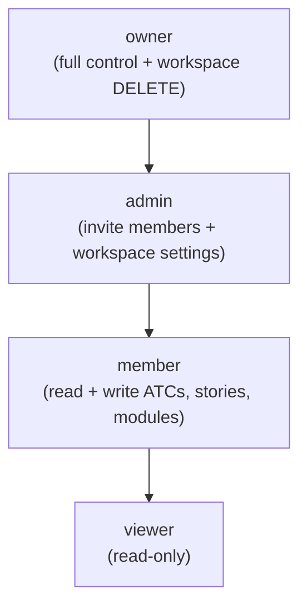

# User Personas — Bunkai TMS

> Generated: 2026-06-23
> Source: Supabase migrations, middleware, lib/api, app route analysis.
> Personas are derived from system roles — not invented demographics.

---

## 1. Persona Discovery Summary

| Persona | System Role | Access Level | Primary Goal |
|---------|------------|-------------|-------------|
| QA Engineer | `member` | Read + write Projects, Modules, Stories, ATCs | Author and maintain Acceptance Test Cases anchored to ACs |
| QA Lead / Test Manager | `admin` or `owner` | All member rights + manage workspace members, invite team | Govern quality coverage, manage the team workspace |
| Workspace Owner | `owner` | All admin rights + workspace DELETE | Bootstrap and own the Bunkai workspace for the organization |
| AI Agent / CLI Consumer | PAT bearer (any role) | Scoped by PAT capabilities (`atc:read`, `atc:write`, `run:execute`, `workspace:admin`) | Programmatic ATC creation, test execution reporting via REST |

---

## 2. Persona 1 — QA Engineer

### Identity

| Attribute | Value |
|-----------|-------|
| System Role | `member` |
| Evidence | `supabase/migrations/0001_tenancy.sql` line 43 (role CHECK constraint) |
| Access Level | Full read + write on Projects, Modules, Stories, ATCs within their workspace |
| Estimated % of Users | ~65% (primary active users) |

### Goals (Inferred from Features)

| Goal | Supporting Feature | Route/Component |
|------|-------------------|----------------|
| Author ATCs linked to at least one AC | ATC creation with AC linkage enforcement | `app/(app)/projects/[projectSlug]/atcs/new/` |
| Browse the test hierarchy visually | Mind-map view | `app/(app)/projects/[projectSlug]/mind-map-view.tsx` |
| Search ATCs by tag or keyword | Full-text search (`tsvector`) | Project explorer + `atcs.tsv` column |
| Import Jira stories to avoid re-typing | Async Jira import | `app/(app)/projects/[projectSlug]/import-from-jira-dialog.tsx` |
| Chain ATCs into end-to-end test sequences | Test chain creation | `app/(app)/projects/[projectSlug]/tests/new/` |

### Pain Points (Inferred from Validation/Errors)

| Pain Point | Evidence |
|-----------|---------|
| Forgetting to link an AC — blocked with 422 | `lib/atcs/validation.ts` line 41: `acceptance_criterion_ids: z.array(z.string().uuid()).min(1)` → error code `validation_failed` |
| Step positions out of order | `lib/atcs/validation.ts` lines 63–76: `steps_position_invalid` 422 with offending positions list |
| Jira import queued while another import is running | `app/api/v1/imports/route.ts` lines 55–58: `conflict` 409 with `reason: 'import_in_progress'` |

### Feature Access

| Feature | Access | Evidence |
|---------|--------|---------|
| Create/edit ATCs | Full | RLS member+ INSERT policy on `atcs` |
| Read project module tree | Full | RLS — all active members can SELECT |
| Import from Jira | Full | `import_jobs` INSERT policy gates to member+ (`app/api/v1/imports/route.ts`) |
| Invite workspace members | None | Invite = admin/owner only (`supabase/migrations/0010_workspace_invites.sql`) |
| Delete workspace | None | Owner only |

### User Journey Summary

```
Login (magic link) → /projects → Select project → Browse module tree → New ATC → Link ACs → Submit
```

### Profile Attributes (from User Model)

Supabase Auth manages `auth.users`. Application-level profile is the `workspace_members` join:
- `user_id` (UUID, from `auth.users`)
- `workspace_id` (UUID)
- `role` = `member`
- `status` = `active` | `invited` | `suspended`
- `joined_at` (timestamptz)

Email is stored in `auth.users.email` (Supabase Auth).

### Representative Quote (inferred)

> "I need to know which ACs my test covers without digging through a spreadsheet every time." *(inferred)*

---

## 3. Persona 2 — QA Lead / Test Manager

### Identity

| Attribute | Value |
|-----------|-------|
| System Role | `admin` |
| Evidence | `supabase/migrations/0001_tenancy.sql` line 43; `app/(app)/workspaces/[id]/members/members-client.tsx` line 3 |
| Access Level | All member rights + invite members, manage roles, workspace settings |
| Estimated % of Users | ~20% |

### Goals (Inferred from Features)

| Goal | Supporting Feature | Route/Component |
|------|-------------------|----------------|
| Invite QA engineers to the workspace | Workspace invite system | `app/(app)/workspaces/[id]/members/`; `app/api/v1/invites/` |
| Monitor team test coverage via project tree | Project explorer | `app/(app)/projects/[projectSlug]/page.tsx` |
| Review and manage workspace members | Members management screen | `app/(app)/workspaces/[id]/members/members-client.tsx` |
| Issue PATs for CI/AI integrations | Token management | `app/api/v1/tokens/` |

### Pain Points (Inferred from Validation/Errors)

| Pain Point | Evidence |
|-----------|---------|
| Invite expires before recipient accepts | `supabase/migrations/0010_workspace_invites.sql` line 23: `expires_at = now() + interval '7 days'` |
| Member invite rejected because email already belongs to workspace | `supabase/migrations/0022_invite_integrity_user_lookup.sql` (invite integrity check) |

### Feature Access

| Feature | Access | Evidence |
|---------|--------|---------|
| Invite members | Full | Admin+ only RLS INSERT on `workspace_invites` |
| Change member roles (viewer/member/admin) | Full | Members screen role selector (`members-client.tsx` line 3) |
| Revoke workspace invites | Full | Admin+ |
| Delete workspace | None | Owner only |
| Issue PATs for workspace | Full (scoped to own user) | `app/api/v1/tokens/` |

### User Journey Summary

```
Login → /projects → Workspace switcher → /workspaces/[id]/members → Invite by email + role → Monitor
```

### Representative Quote (inferred)

> "I want every test case to be traceable to a story before the sprint is done — not explained after the fact." *(inferred)*

---

## 4. Persona 3 — Workspace Owner

### Identity

| Attribute | Value |
|-----------|-------|
| System Role | `owner` |
| Evidence | `supabase/migrations/0001_tenancy.sql` line 43 (role=owner) and `0006_bootstrap_workspace.sql` (creator becomes owner) |
| Access Level | All admin rights + workspace DELETE |
| Estimated % of Users | ~5% (one per workspace) |

### Goals (Inferred from Features)

| Goal | Supporting Feature | Route/Component |
|------|-------------------|----------------|
| Bootstrap the workspace on first login | Onboarding form | `app/(app)/onboarding/onboarding-form.tsx` |
| Set workspace plan (community/cloud/enterprise) | Workspace creation | `supabase/migrations/0001_tenancy.sql` line 32 |
| Full administrative control over workspace lifecycle | Workspace management | `supabase/migrations/0001_tenancy.sql` |

### Feature Access

| Feature | Access | Evidence |
|---------|--------|---------|
| All admin capabilities | Full | Owner inherits admin |
| Delete workspace | Full | Owner-only RLS DELETE policy on `workspaces` |
| Change workspace plan | Unknown | Schema column exists; no UI gating code found |

### Representative Quote (inferred)

> "I set this up for the team — I need to know I'm the one who controls access." *(inferred)*

---

## 5. Role Hierarchy



Source: `supabase/migrations/0001_tenancy.sql` line 43 — role CHECK constraint order implies hierarchy.

---

## 6. Permission Matrix

| Permission | viewer | member | admin | owner |
|-----------|--------|--------|-------|-------|
| Read project tree, modules, stories, ATCs | ✅ | ✅ | ✅ | ✅ |
| Create / edit ATCs | ❌ | ✅ | ✅ | ✅ |
| Import from Jira | ❌ | ✅ | ✅ | ✅ |
| Create modules, user stories | ❌ | ✅ | ✅ | ✅ |
| Create test chains | ❌ | ✅ | ✅ | ✅ |
| Invite workspace members | ❌ | ❌ | ✅ | ✅ |
| Manage member roles | ❌ | ❌ | ✅ | ✅ |
| Revoke invites | ❌ | ❌ | ✅ | ✅ |
| Issue / revoke PATs (own tokens) | ❌ | ✅ | ✅ | ✅ |
| Delete workspace | ❌ | ❌ | ❌ | ✅ |

Sources: `supabase/migrations/0001_tenancy.sql` (RLS policies), `app/(app)/projects/[projectSlug]/page.tsx` lines 56–66 (canCreate check), `app/api/v1/imports/route.ts` (member+ gate comment).

Note: `viewer` role is read-only at the UI layer (canCreate=false) AND at the DB layer (RLS blocks INSERT for viewers). Both layers verified.

---

## 7. Discovery Gaps

| Gap | Why It Matters | Question to Ask |
|-----|---------------|-----------------|
| No separate `admin`-only UI routes detected | Unclear if there is an admin dashboard beyond member management | Is there a dedicated admin panel planned? Check for `/admin` or `/settings` routes |
| `viewer` can switch workspaces — unclear if they can see ALL workspaces they belong to as viewer | If a user is `viewer` in workspace A and `admin` in workspace B, can they switch? | Test workspace switcher with multi-role user |
| PAT holder persona definition | A PAT does not define a human role — what human role issues the PAT? | Check if viewers can issue PATs (permission matrix says yes; verify in practice) |
| `workspace:admin` PAT scope — what operations does it unlock beyond `atc:write`? | Scope exists in schema but handler usage not fully audited | Audit `app/api/v1/workspaces/route.ts` and `lib/api/principal.ts` |

---

## 8. QA Relevance

### Test Account Requirements

| Persona | Test Account | Permissions Needed | `.env` Key |
|---------|-------------|-------------------|-----------|
| QA Engineer (member) | `LOCAL_USER_EMAIL` | `member` role in test workspace | `.env` — needs creation |
| QA Lead (admin) | `LOCAL_ADMIN_EMAIL` | `admin` role in test workspace | `.env` — needs creation |
| Workspace Owner | `LOCAL_OWNER_EMAIL` | `owner` role (or the email that bootstrapped the workspace) | `.env` — needs creation |
| Viewer (read-only) | `LOCAL_VIEWER_EMAIL` | `viewer` role in test workspace | `.env` — needs creation |
| Staging QA Engineer | `STAGING_USER_EMAIL` | `member` role in staging workspace | `.env` — needs creation |
| Staging Admin | `STAGING_ADMIN_EMAIL` | `admin` role in staging workspace | `.env` — needs creation |

Note: `.env.example` does not define `LOCAL_USER_EMAIL` / `STAGING_USER_EMAIL` variants — these need to be added by the QA team.

### Critical Persona Flows to Test

1. **Member** creates an ATC without AC links → expects 422 `validation_failed`
2. **Viewer** attempts POST /api/v1/atcs → expects 403 `forbidden` (RLS INSERT block)
3. **Admin** invites a new member → member receives invite, accepts, gains `active` status
4. **Owner** suspends a member → suspended member loses data access (RLS `status = 'active'` check)
5. **PAT holder** with `atc:read` scope attempts `atc:write` operation → expects 403 `forbidden`

### Edge Cases by Persona

| Persona | Edge Case | Expected Behavior |
|---------|----------|------------------|
| member | Accepts invite after 7-day expiry | 422 or 410 — invite expired |
| viewer | Tries to create a module via UI | Button hidden (canCreate=false), API returns 403 if forced |
| admin | Tries to promote another admin to owner | Unknown — check if role change to `owner` is supported |
| owner | Deletes workspace with active members | Cascade behavior — check FK constraints |
| PAT | Sends request with revoked token | 401 `unauthorized` (uniform — no reveal of which check failed) |
