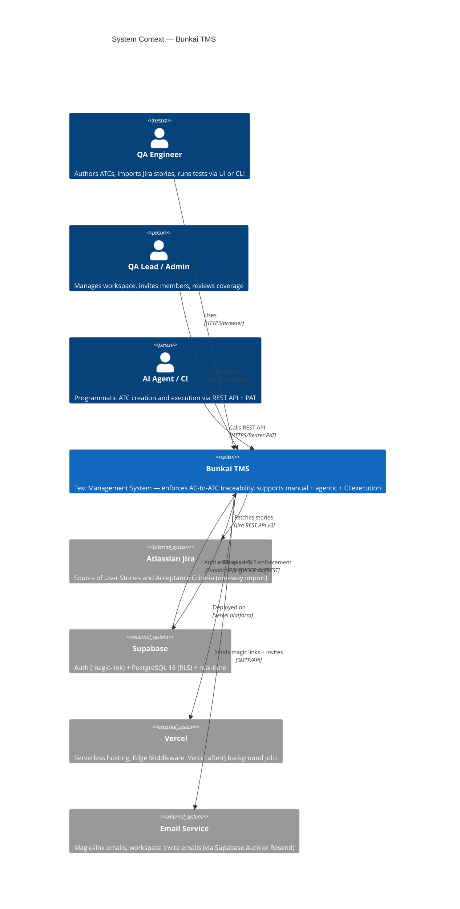
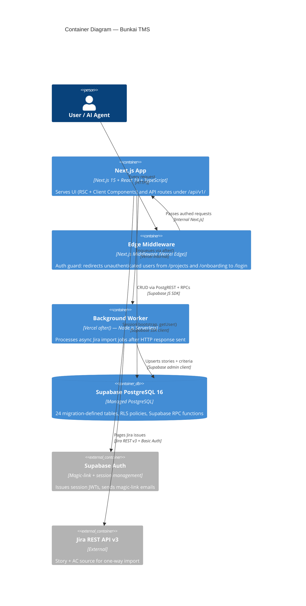
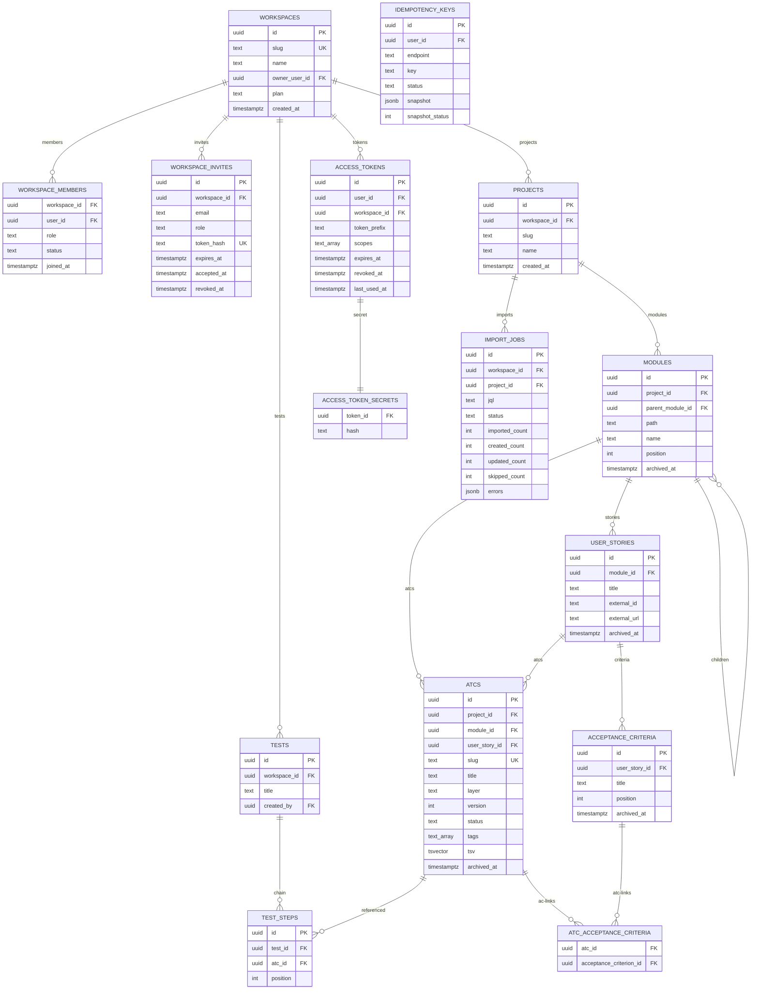

# Architecture — Bunkai TMS

> Generated: 2026-06-23
> Source: Supabase migrations, `lib/`, `middleware.ts`, `next.config.ts`, `lib/env.ts`, route structure.

---

## 1. System Overview

| Attribute | Value |
|-----------|-------|
| Architecture Pattern | Modular Monolith (Next.js App Router — co-located frontend + backend API routes) |
| Deployment Model | Serverless (Vercel — Edge Middleware + Serverless Functions for API routes) |
| Database | PostgreSQL 16 via Supabase (managed) |
| Auth | Supabase Auth (magic-link passwordless) + custom PAT bearer for machine callers |
| API Version | REST JSON, versioned at `/api/v1/` |
| Phase 2 Target | NestJS separate backend service (not yet implemented) |

### Tech Stack Table

| Layer | Technology | Version | Evidence |
|-------|-----------|---------|---------|
| Runtime | Bun | 1.x | `package.json` scripts |
| Framework | Next.js | 15 | `package.json` |
| Language | TypeScript | 5.9+ | `tsconfig.json` |
| UI | React | 19 | `package.json` |
| Styling | Tailwind CSS + CVA + tw-merge | 3.4 | `tailwind.config.ts` |
| UI Primitives | Radix UI + shadcn/ui | Latest | `components.json` |
| Database | Supabase (PostgreSQL 16) | — | `dbhub.toml` |
| Auth Client | `@supabase/ssr` | Latest | `lib/supabase/server.ts` |
| Validation | Zod 4.x | 4.x | `lib/atcs/validation.ts` |
| OpenAPI | `@asteasolutions/zod-to-openapi` | Latest | `lib/openapi/registry.ts` |
| API Docs | `@scalar/api-reference-react` | Latest | `app/api/docs/page.tsx` |
| Tables | TanStack Table | 8.x | `package.json` |
| Editor | Monaco Editor | Latest | `package.json` |
| Hosting | Vercel (serverless) | — | `.agents/project.yaml` |

---

## 2. C4 Context Diagram



---

## 3. C4 Container Diagram



---

## 4. Component Structure

| Directory | Role | Key Files |
|-----------|------|-----------|
| `app/(app)/` | Authenticated app routes (RSC) | `onboarding/`, `projects/`, `workspaces/` |
| `app/(auth)/` | Auth routes | `login/page.tsx`, `magic-link-form.tsx` |
| `app/api/v1/` | REST API handlers | `atcs/`, `imports/`, `tests/`, `tokens/`, `workspaces/`, `health/`, `auth/` |
| `app/api/openapi/` | OpenAPI spec endpoint | `route.ts` (force-static, serves `public/openapi.json`) |
| `app/api/docs/` | Scalar API viewer | `page.tsx` |
| `app/invites/` | Invite redemption (public) | `accept/page.tsx` |
| `app/qa/` | Software Testability Guide (public) | `page.tsx`, `qa-config.ts` |
| `lib/api/` | API middleware, error envelope, handler wrapper | `error-envelope.ts`, `handler.ts`, `principal.ts`, `bearer.ts`, `idempotency.ts`, `logging.ts` |
| `lib/atcs/` | ATC domain logic | `validation.ts`, `builder-guards.ts`, `sanitize.ts`, `errors.ts` |
| `lib/jira/` | Jira integration | `client.ts`, `import-runner.ts`, `extract-acceptance-criteria.ts`, `adf-to-markdown.ts` |
| `lib/supabase/` | Supabase client factories | `server.ts`, `client.ts`, `admin.ts`, `rpc.ts`, `with-workspace.ts` |
| `lib/openapi/` | OpenAPI registry + builder | `registry.ts` |
| `lib/types/` | TypeScript types (generated + manual) | `supabase.ts` (generated via `bun run types:gen`) |
| `components/layout/` | App shell UI | `AppSidebar.tsx`, `Topbar.tsx`, `WorkspaceSwitcher.tsx`, `CommandPalette.tsx` |
| `components/ui/` | shadcn/ui component set | `button.tsx`, `card.tsx`, `input.tsx`, `tabs.tsx`, `badge.tsx`, `label.tsx` |
| `supabase/migrations/` | SQL migration files | 24 files (`0001_tenancy.sql` → `0024_tests.sql`) |
| `public/` | Static assets | `openapi.json` (generated by `bun run openapi:gen`) |

---

## 5. Database Schema

### ER Diagram (Core Entities)



### Key Table Details

| Table | PK Type | Notable Constraints | Source |
|-------|---------|--------------------|----|
| `workspaces` | UUID | `slug` UNIQUE; `plan` CHECK IN ('community','cloud','enterprise'); `owner_user_id` FK | `0001_tenancy.sql` |
| `workspace_members` | Composite (workspace_id, user_id) | `role` CHECK IN ('viewer','member','admin','owner'); `status` CHECK IN ('active','invited','suspended') | `0001_tenancy.sql` line 43 |
| `modules` | UUID | `path` CHECK (depth ≤ 6 by '/' count); `parent_module_id` self-FK; `archived_at` soft-delete | `0002_projects_modules.sql` lines 109–121 |
| `atcs` | UUID | `slug` UNIQUE per project; `layer` CHECK IN ('UI','API','Unit'); `status` CHECK IN (6 values); `tsv` GIN index | `0004_atcs.sql` |
| `atc_acceptance_criteria` | Composite (atc_id, criterion_id) | M:N; no direct DB constraint enforcing min(1) per ATC (app-layer only) | `0004_atcs.sql` |
| `access_tokens` | UUID | Soft-delete (`revoked_at`); no DELETE RLS; `last_used_at` fire-and-forget | `0008_access_tokens.sql` |
| `access_token_secrets` | UUID (token_id FK) | Hash-only; separate table so analytics roles cannot read it | `0011_split_token_secrets.sql` |
| `import_jobs` | UUID | Partial unique index: `(project_id) WHERE status IN ('queued','running')` | `0020_import_jobs_one_active.sql` |
| `idempotency_keys` | UUID | Unique `(user_id, endpoint, key)` | `0009_cross_cutting.sql` |

---

## 6. Data Flow — Auth Sequence

```mermaid
sequenceDiagram
    participant B as Browser
    participant MW as Edge Middleware
    participant NS as Next.js Server
    participant SA as Supabase Auth
    participant DB as PostgreSQL (RLS)

    Note over B,MW: Cookie auth flow
    B->>MW: GET /projects (no session cookie)
    MW->>SA: getUser() — verify session
    SA-->>MW: null (no session)
    MW-->>B: 302 Redirect /login?next=/projects

    B->>NS: POST /api/v1/auth/magic-link (email)
    NS->>SA: signInWithOtp(email)
    SA-->>B: 200 (email sent)
    B->>NS: GET /auth?code=... (magic link clicked)
    NS->>SA: exchangeCodeForSession(code)
    SA-->>NS: Session JWT + refresh token
    NS-->>B: Set-Cookie: sb-...-auth-token; 302 /projects

    Note over B,DB: Subsequent requests
    B->>MW: GET /projects (with session cookie)
    MW->>SA: getUser() — validates JWT
    SA-->>MW: User object
    MW->>NS: Pass through
    NS->>DB: SELECT (RLS: auth.uid() = user_id; status = 'active')
    DB-->>NS: Filtered rows
    NS-->>B: 200 + page

    Note over B,DB: Bearer PAT flow
    B->>NS: POST /api/v1/atcs (Authorization: Bearer bk_pat_...)
    NS->>DB: SELECT access_tokens WHERE token_prefix = '...' LIMIT 5
    DB-->>NS: Candidate rows
    NS->>DB: SELECT access_token_secrets WHERE token_id IN (...)
    DB-->>NS: Hash rows
    NS->>NS: SHA-256 compare, expiry/revocation check
    NS->>DB: INSERT INTO atcs ... (as impersonated user JWT)
    DB-->>NS: RLS applied — user must be workspace member
    NS-->>B: 201 + ATC body
```

---

## 7. External Services

| Service | Purpose | Integration Method | Auth | Evidence |
|---------|---------|-------------------|------|---------|
| Supabase (Auth) | Magic-link auth, session JWT, user management | `@supabase/ssr` server client | Anon key + service role key | `lib/supabase/server.ts`; `lib/env.ts` |
| Supabase (PostgreSQL 16) | Primary database, RLS enforcement, RPCs | Supabase JS SDK (PostgREST) | Anon key (user RLS) + service role (admin) | `lib/supabase/admin.ts`; `lib/supabase/rpc.ts` |
| Vercel | Hosting, serverless functions, Edge Middleware | Platform deployment | Vercel env vars | `.agents/project.yaml` |
| Atlassian Jira | User Story + AC source (one-way import) | Jira REST API v3 (`lib/jira/client.ts`) | Basic Auth (email + API token) | `lib/env.ts` lines 36–39; `lib/jira/client.ts` |
| Email (unconfirmed) | Magic-link emails, workspace invite emails | Unknown — Supabase Auth built-in or Resend | `RESEND_API_KEY` in `.env.example` | `RESEND_API_KEY` present; no Resend call found in app code |
| DBHub MCP | DB query tool for QA/AI agents | DBHub MCP server (`dbhub.toml`) | `DBHUB_*` env vars | `dbhub.toml` |

---

## 8. Security Architecture

### Authentication

| Method | Mechanism | Token Lifetime | Evidence |
|--------|----------|---------------|---------|
| Magic-link (web browser) | Supabase Auth OTP → session JWT cookie | Session (auto-refresh in middleware) | `middleware.ts`; `lib/supabase/server.ts` |
| Bearer PAT (CLI/agent) | `bk_pat_<prefix>.<secret>` format; SHA-256 hash stored | Optional `expires_at`; soft-revoke via `revoked_at` | `lib/api/middleware/bearer.ts`; `supabase/migrations/0008_access_tokens.sql` |

### Authorization

| Mechanism | Scope | Evidence |
|-----------|-------|---------|
| Supabase RLS (Row-Level Security) | Every table; tenant boundary = `workspace_members` | `supabase/migrations/0005_rls_helpers.sql`; all migrations |
| Next.js middleware auth guard | Route-level: `/projects`, `/onboarding` prefixes | `middleware.ts` lines 8–9, 48–52 |
| `requireCapability()` | API-level: PAT scope enforcement | `lib/api/principal.ts` lines 79–82 |
| Role check in Server Components | UI affordance gate (canCreate) | `app/(app)/projects/[projectSlug]/page.tsx` lines 56–66 |

### Secret Handling

| Secret | Storage | Evidence |
|--------|---------|---------|
| `SUPABASE_SERVICE_ROLE_KEY` | `.env` only; validated by `lib/env.ts` Zod schema; never sent to browser | `lib/env.ts` line 23 (`SUPABASE_SERVICE_ROLE_KEY: z.string().min(1)`) |
| `SUPABASE_JWT_SECRET` | `.env` only; optional | `lib/env.ts` line 27 |
| PAT raw secret | Returned ONCE on creation; only SHA-256 stored (in sibling table) | `lib/api/middleware/bearer.ts` lines 76–78; `supabase/migrations/0011_split_token_secrets.sql` |
| `ATLASSIAN_API_TOKEN` | `.env` only; optional | `lib/env.ts` lines 37–39 |

### Data Protection

- RLS enabled on all application tables — tenant isolation is structural (not application-layer)
- `access_token_secrets` in a separate table prevents analytics-role reads of hashes
- INV-3 (non-disclosure): cross-workspace resource existence never revealed in error responses
- No at-rest encryption configuration found beyond Supabase's default PostgreSQL encryption

---

## 9. Performance Hooks

| Mechanism | Implementation | Evidence |
|-----------|---------------|---------|
| Static OpenAPI serving | `export const dynamic = 'force-static'` on `/api/openapi` route; `cache-control: public, max-age=300` | `app/api/openapi/route.ts` lines 14, 22 |
| Full-text search (tsvector) | `atcs.tsv` column with GIN index | `supabase/migrations/0004_atcs.sql` |
| Jira import pagination | `PAGE_SIZE = 100`, `MAX_PAGES = 1000` — prevents unbounded queries | `lib/jira/import-runner.ts` lines 28–29 |
| `typedRoutes: true` | Next.js typed routes — eliminates runtime route-resolution overhead | `next.config.ts` line 6 |
| Supabase connection pooling | Managed by Supabase (PgBouncer) — no custom pool config found | Discovery Gap |
| Rate limiting | `RATE_LIMITED` error code defined but no rate-limit middleware found | `lib/api/error-envelope.ts` line 25; no `@upstash/ratelimit` in package.json |

---

## 10. Discovery Gaps

| Gap | Where Looked | Impact |
|-----|-------------|--------|
| Email service provider | `package.json`, `lib/`, `app/api/` — no Resend call found despite `RESEND_API_KEY` | Cannot confirm transactional email delivery |
| Rate limiting implementation | `middleware.ts`, `lib/api/handler.ts`, `package.json` — `rate_limited` code defined but no middleware | Security/reliability gap — no DOS protection confirmed |
| Supabase connection pool configuration | `lib/supabase/` — only SDK defaults used | Performance at scale unknown |
| `lib/supabase-types.ts` | Not committed — generated by `bun run types:gen` | Full type coverage unknown until generated |
| Next.js security headers | `next.config.ts` — only `typedRoutes + reactStrictMode + remotePatterns` | No CSP / HSTS headers configured at framework level (may be Vercel platform default) |
| Background worker retry / timeout | `lib/jira/import-runner.ts` — Vercel `after()` timeout not confirmed | Import jobs may silently time out on large JQL queries |

---

## 11. QA Relevance

### Components to Test

| Component | Test Type | Priority |
|-----------|----------|---------|
| Middleware auth guard | Integration — hit protected routes with/without session | P0 |
| `requireBearerToken` | Unit — all 401 paths (missing header, bad format, revoked, expired) | P0 |
| `requireCapability` | Unit — scope enforcement per endpoint | P0 |
| RLS policies | Integration via DBHub — test per-role data access | P0 |
| `bunkai_save_atc` RPC | Integration — cross-entity validation (AC ∈ US, module ∈ project) | P0 |
| `bunkai_create_test` RPC | Integration — chain validation, INV-3 non-disclosure | P1 |
| Jira import worker | Integration — queued → running → completed/failed lifecycle | P1 |
| Static OpenAPI serving | Smoke — `GET /api/openapi` returns valid JSON | P2 |

### Environment Requirements

- Separate test workspace per environment (due to shared Supabase project risk)
- `ATLASSIAN_*` credentials with access to a Jira test project for import testing
- At minimum 4 test user accounts per environment (viewer / member / admin / owner)
- PAT with each of the 4 scopes for API-level scope testing
