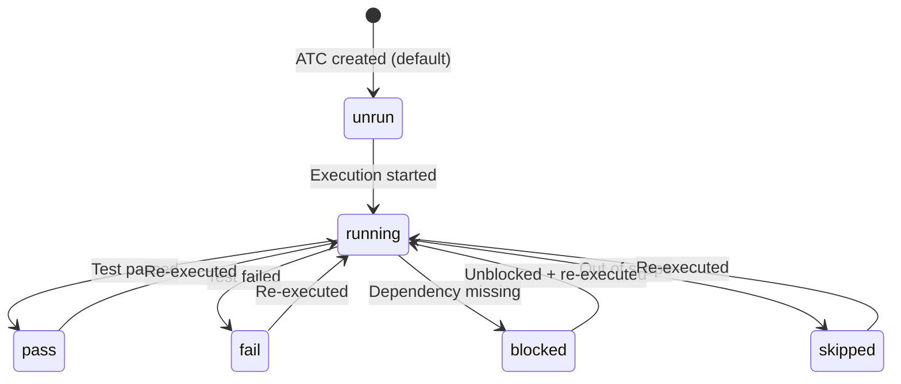
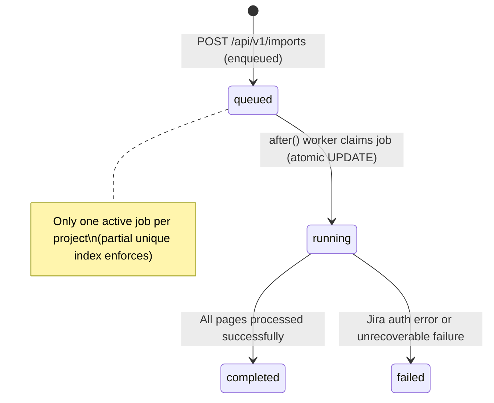
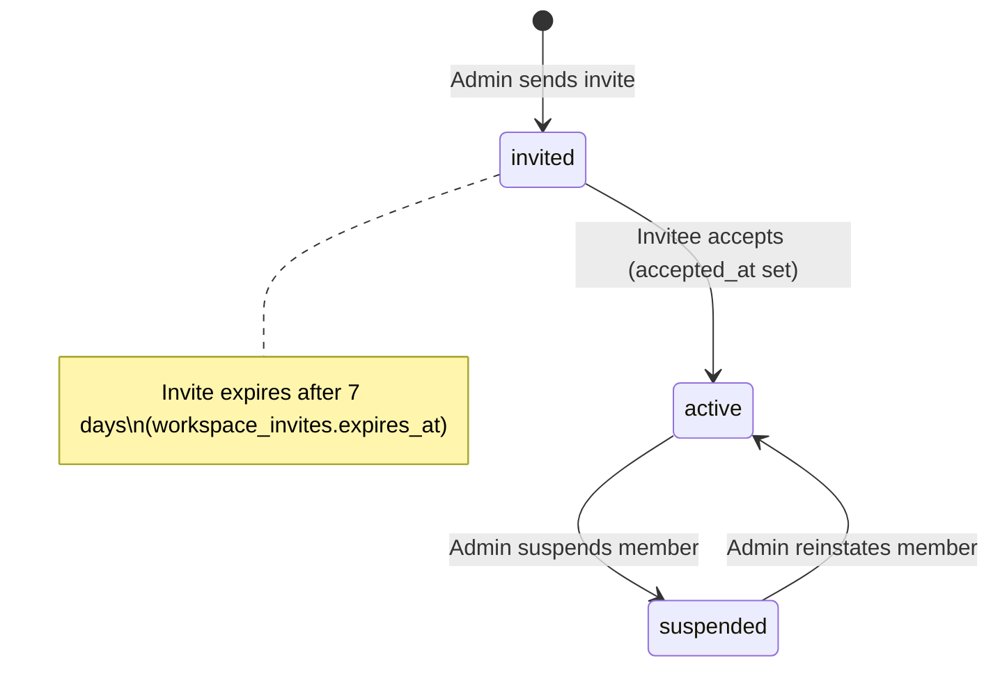
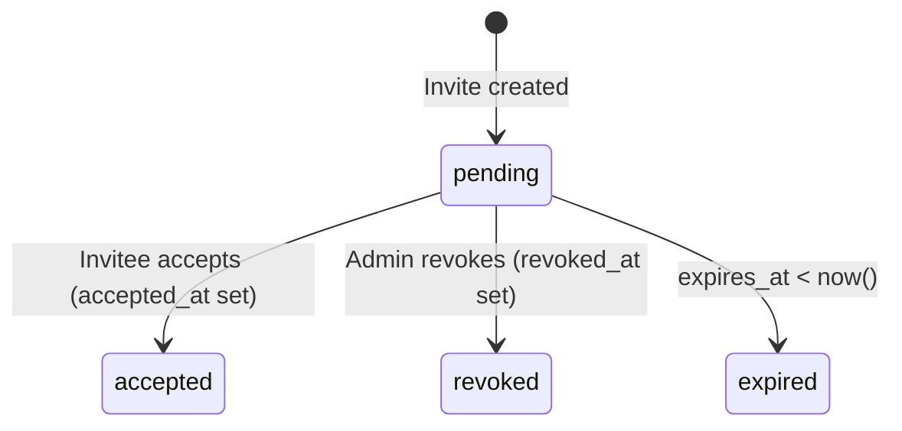
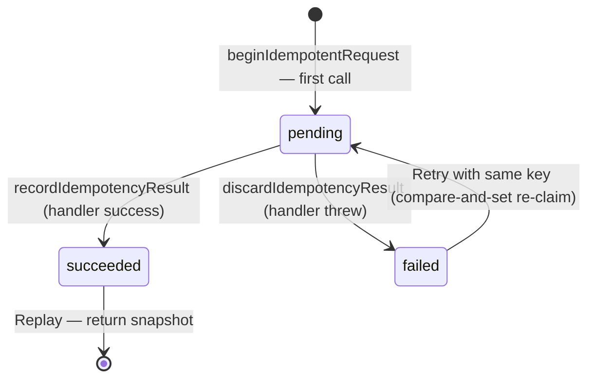

# Functional Specifications — Bunkai TMS

> Generated: 2026-06-23
> Source: `lib/atcs/validation.ts`, `lib/api/error-envelope.ts`, `lib/api/handler.ts`, `lib/api/principal.ts`, `app/api/v1/` route handlers, Supabase migrations.

---

## Specification Index

| FR-ID | Feature | Category | Priority |
|-------|---------|---------|---------|
| FR-001 | Magic-Link Authentication | Auth | P0 |
| FR-002 | ATC Creation with Enforced AC Linkage | Test Authoring | P0 |
| FR-003 | PAT Issuance and Bearer Authentication | API Access | P0 |
| FR-004 | Jira Import (Async, JQL-based) | Integration | P1 |
| FR-005 | Test Chain Creation | Test Composition | P1 |
| FR-006 | Workspace Invite System | Workspace Management | P1 |
| FR-007 | Module Tree Management (Max Depth 6) | Organization | P1 |

---

## FR-001: Magic-Link Authentication

### Overview

| Attribute | Value |
|-----------|-------|
| Feature | Passwordless authentication via email magic link |
| Related PRD Section | User Journeys — Journey 1 (Onboarding) |
| Service/Method | `app/api/v1/auth/magic-link/route.ts` → Supabase `signInWithOtp` |
| Evidence | `app/(auth)/login/page.tsx`; `lib/supabase/server.ts`; `middleware.ts` |

### Functional Requirement

A user provides their email address; the system sends a one-time magic link via Supabase Auth; clicking the link establishes a session cookie used for all subsequent authenticated requests.

### Input Specification

| Field | Type | Required | Validation | Source |
|-------|------|---------|-----------|--------|
| `email` | string | Yes | Valid email format (Supabase Auth validation) | `app/(auth)/login/magic-link-form.tsx` (form input) |

### Validation Rules

```
email: z.string().email()   // Supabase Auth enforces on server
```
Source: Supabase Auth built-in. No custom Zod schema found for magic-link route.

### Processing Logic

1. `POST /api/v1/auth/magic-link` receives email
2. Calls `supabase.auth.signInWithOtp({ email })` via Supabase Auth
3. Supabase sends email with OTP link
4. User clicks link → hits `/auth` callback route
5. `exchangeCodeForSession(code)` → session JWT + refresh token set as cookie
6. Middleware on subsequent requests: `supabase.auth.getUser()` validates JWT, refreshes if expiring

Source: `app/(auth)/login/page.tsx` (form rendering); `middleware.ts` lines 22–44 (session refresh on every request).

### Output Specification

| Scenario | Response | Details |
|---------|---------|---------|
| Success | 200 (email sent) | Magic link delivered to inbox |
| Auth callback success | 302 redirect | To `?next=` param or `/projects` |
| Auth callback failure | Redirect to `/login` with error | Supabase Auth error handling |

### Business Rules

| BR-ID | Rule |
|-------|------|
| BR-001 | Authenticated users hitting `/login` are redirected to `/projects` (no double-login) |
| BR-002 | Unauthenticated users hitting `/projects` or `/onboarding` are redirected to `/login?next=<path>` |

Evidence: `app/(auth)/login/page.tsx` lines 17–19; `middleware.ts` lines 48–52.

### Edge Cases

| Scenario | Expected Behavior | Evidence |
|---------|-----------------|---------|
| Magic link clicked after expiry | Supabase Auth rejects; redirect to `/login` with error | Supabase Auth built-in |
| Already signed-in user hits `/login` | Redirect to `/projects` | `app/(auth)/login/page.tsx` lines 17–19 |
| User has no workspace after auth | Redirect from `/projects` to `/onboarding` | `app/(app)/onboarding/page.tsx` lines 15–22 |

---

## FR-002: ATC Creation with Enforced AC Linkage

### Overview

| Attribute | Value |
|-----------|-------|
| Feature | Create an Acceptance Test Case linked to ≥1 Acceptance Criterion |
| Related PRD Section | User Journeys — Journey 2 (ATC Authoring) |
| Service/Method | `POST /api/v1/atcs` → `bunkai_save_atc` RPC |
| Evidence | `app/api/v1/atcs/route.ts`; `lib/atcs/validation.ts`; `lib/supabase/rpc.ts` |

### Functional Requirement

A member+ user submits an ATC with at minimum: a title, a layer classification, at least one step, and at least one Acceptance Criterion link; the system validates, persists, and returns the created ATC.

### Input Specification

| Field | Type | Required | Validation | Source |
|-------|------|---------|-----------|--------|
| `title` | string | Yes | min 3, max 200 chars | `lib/atcs/validation.ts` lines 16–17 |
| `layer` | enum | Yes | `'UI' \| 'API' \| 'Unit'` | `lib/atcs/validation.ts` line 9 |
| `tags` | string[] | No | max 10 items | `lib/atcs/validation.ts` line 17 |
| `steps` | AtcStep[] | Yes | min 1 item; each step content min 1 char, max 2048 bytes | `lib/atcs/validation.ts` lines 22–27 |
| `assertions` | AtcAssertion[] | No | each content min 1 char, max 2048 bytes | `lib/atcs/validation.ts` lines 29–31 |
| `acceptance_criterion_ids` | uuid[] | Yes | **min(1) — the anchoring moat** | `lib/atcs/validation.ts` line 41 |
| `module_id` | uuid | Yes | Must belong to the ATC's project | `lib/atcs/validation.ts` lines 44–47 |
| `user_story_id` | uuid | Yes | ACs must belong to this story | `lib/atcs/validation.ts` lines 44–47 |

### Validation Rules

```typescript
// lib/atcs/validation.ts
title: z.string().min(3).max(200)
layer: z.enum(['UI', 'API', 'Unit'])
tags: z.array(z.string()).max(10).optional().default([])
steps: z.array(AtcStepInputSchema).min(1)
  // AtcStepInputSchema:
  //   position: z.number()
  //   content: z.string().min(1).refine(withinContentBudget)  // <= 2048 bytes
  //   input_data: z.string().refine(withinContentBudget).nullable().optional()
  //   expected: z.string().refine(withinContentBudget).nullable().optional()
assertions: z.array(AtcAssertionInputSchema).optional().default([])
  // AtcAssertionInputSchema:
  //   content: z.string().min(1).refine(withinContentBudget)  // <= 2048 bytes
acceptance_criterion_ids: z.array(z.string().uuid()).min(1)  // THE ANCHORING MOAT

// Step positions: integers, strictly increasing from 1. Gaps allowed.
// Validated by stepPositionsError() after Zod parse.
```

### Processing Logic

1. `withApiHandler` resolves identity (cookie or Bearer PAT with `atc:write` scope)
2. `AtcCreateBodySchema.parse(payload)` — Zod validation (422 on failure)
3. `stepPositionsError(body.steps)` — strict position check (422 `steps_position_invalid` if failing)
4. `sanitizeAtcSteps` / `sanitizeAtcAssertions` — content sanitization
5. `createAtc(supabase, params)` → `bunkai_save_atc` SECURITY DEFINER RPC:
   - Derives `project_id` from `user_story_id`
   - Validates `module_id ∈ project subtree`
   - Validates `acceptance_criterion_ids ∈ user_story_id`
   - Computes immutable `slug` (title-based)
   - Writes `atcs` + `atc_steps` + `atc_assertions` + `atc_acceptance_criteria` transactionally
   - Emits `atc.created` activity event
6. Returns 201 + `{ atc: data }`

Source: `app/api/v1/atcs/route.ts`; `lib/supabase/rpc.ts`.

### Output Specification

| Scenario | Status | Response Body |
|---------|--------|--------------|
| Success | 201 | `{ atc: { id, slug, title, layer, tags, status, ... } }` |
| Missing/empty ACs | 422 | `{ error: { code: 'validation_failed', ... } }` |
| Invalid step positions | 422 | `{ error: { code: 'steps_position_invalid', details: { positions: [...] } } }` |
| AC not in User Story | 422 | `{ error: { code: 'ac_outside_user_story', ... } }` |
| Module not in project | 422 | `{ error: { code: 'module_outside_project_subtree', ... } }` |
| Slug collision | 409 | `{ error: { code: 'slug_collision', ... } }` |
| Unauthorized | 401 | `{ error: { code: 'unauthorized', ... } }` |
| Viewer role (missing `atc:write`) | 403 | `{ error: { code: 'forbidden', ... } }` |

### Business Rules

| BR-ID | Rule | Evidence |
|-------|------|---------|
| BR-ATC-001 | Every ATC must link ≥1 Acceptance Criterion (anchoring moat) | `lib/atcs/validation.ts` line 41 |
| BR-ATC-002 | ATC slug is immutable and computed from title at creation | `lib/supabase/rpc.ts` (bunkai_save_atc RPC) |
| BR-ATC-003 | Step positions must be integers, strictly increasing, starting at 1 (gaps allowed) | `lib/atcs/validation.ts` lines 63–76 |
| BR-ATC-004 | ATC status defaults to `unrun` on creation | `supabase/migrations/0004_atcs.sql` line 62 |
| BR-ATC-005 | Content fields have a 2048-byte UTF-8 budget (not char count) | `lib/atcs/validation.ts` lines 14–19 |

### Edge Cases

| Scenario | Expected Behavior | Evidence |
|---------|-----------------|---------|
| Step positions `[2, 3, 4]` (not starting at 1) | 422 `steps_position_invalid`, positions: [2] | `lib/atcs/validation.ts` line 70 |
| Step positions `[1, 1, 2]` (duplicate) | 422 `steps_position_invalid`, positions: [1] (second) | `lib/atcs/validation.ts` line 70 |
| Content field at exactly 2048 bytes (UTF-8) | Passes validation | `lib/atcs/validation.ts` line 14 (boundary = 2048) |
| Content field at 2049 bytes | 422 `validation_failed` with content budget error | `lib/atcs/validation.ts` lines 19–20 |
| 11 tags | 422 `validation_failed` (max 10) | `lib/atcs/validation.ts` line 17 |

---

## FR-003: PAT Issuance and Bearer Authentication

### Overview

| Attribute | Value |
|-----------|-------|
| Feature | Issue Personal Access Tokens for programmatic API access |
| Related PRD Section | User Journeys — Journey 5 (PAT Issuance) |
| Service/Method | `POST /api/v1/tokens` → `requireBearerToken` middleware |
| Evidence | `app/api/v1/tokens/route.ts`; `lib/api/middleware/bearer.ts`; `lib/api/pat.ts` |

### Functional Requirement

An authenticated user issues a named PAT with explicit scopes; the raw secret is returned once; subsequent API requests authenticate by presenting the secret in the `Authorization: Bearer` header, which the system validates against the stored hash.

### Input Specification (Token Creation)

| Field | Type | Required | Validation | Source |
|-------|------|---------|-----------|--------|
| `name` | string | Yes | Non-empty display name | `app/api/v1/tokens/route.ts` |
| `scopes` | string[] | Yes | Subset of `['atc:read','atc:write','run:execute','workspace:admin']` | `supabase/migrations/0008_access_tokens.sql` line 35 |
| `workspace_id` | uuid | No | Optional workspace scope | `supabase/migrations/0008_access_tokens.sql` |
| `expires_at` | timestamptz | No | Optional future date | `supabase/migrations/0008_access_tokens.sql` |

### Validation Rules

```typescript
// Bearer header validation (lib/api/middleware/bearer.ts):
// Format: "Bearer bk_pat_<12-char-prefix>.<base64url-secret>"
// TOKEN_FAMILY_PREFIX = 'bk_pat_'
// TOKEN_PREFIX_LENGTH = 12
// All failures → uniform 401 (no hint which check failed)
```

### Processing Logic

**Token Creation:**
1. Mint token: `bk_pat_<12-char-prefix>.<base64url-secret>`
2. Store: `token_prefix` (12 chars) in `access_tokens`; SHA-256 of FULL secret (`prefix+remainder`) in `access_token_secrets`
3. Return full raw token in 201 response (only time it's readable)

**Bearer Validation:**
1. Parse `Authorization: Bearer bk_pat_<prefix>.<remainder>`
2. Reconstruct `fullSecret = prefix + remainder`
3. Lookup by `token_prefix` (indexed O(1))
4. Fetch SHA-256 from `access_token_secrets`
5. Compare SHA-256(`fullSecret`) with stored hash
6. Check `revoked_at IS NULL` and `expires_at > now()`
7. Fire-and-forget `last_used_at` update
8. Return `BearerContext { userId, workspaceId, scopes, tokenId }`

Source: `lib/api/middleware/bearer.ts`.

### Output Specification

| Scenario | Status | Response |
|---------|--------|---------|
| Token created | 201 | `{ token: 'bk_pat_...', id, name, scopes, expires_at }` |
| Valid Bearer request | Passes through to handler | `ctx.principal` populated |
| Invalid/missing header | 401 | `{ error: { code: 'unauthorized', ... } }` |
| Revoked token | 401 | `{ error: { code: 'unauthorized', ... } }` (uniform — no reveal) |
| Valid token, missing scope | 403 | `{ error: { code: 'forbidden', message: 'Missing required capability: <scope>' } }` |

### Business Rules

| BR-ID | Rule | Evidence |
|-------|------|---------|
| BR-PAT-001 | Token raw secret returned exactly once; only SHA-256 hash stored | `lib/api/middleware/bearer.ts` lines 76–78 |
| BR-PAT-002 | All auth failures collapse to uniform 401 — no leak of which check failed | `lib/api/middleware/bearer.ts` lines 30–101 |
| BR-PAT-003 | Revocation is soft (sets `revoked_at`) — no DELETE on `access_tokens` | `supabase/migrations/0008_access_tokens.sql` lines 11–17 |
| BR-PAT-004 | Cookie session holds ALL capabilities; PAT holds only declared scopes | `lib/api/principal.ts` lines 31, 68–69 |

---

## FR-004: Jira Import (Async, JQL-based)

### Overview

| Attribute | Value |
|-----------|-------|
| Feature | Import User Stories + Acceptance Criteria from Jira via JQL |
| Related PRD Section | User Journeys — Journey 3 (Jira Import) |
| Service/Method | `POST /api/v1/imports` → Vercel `after()` worker `runImportJob` |
| Evidence | `app/api/v1/imports/route.ts`; `lib/jira/import-runner.ts` |

### Functional Requirement

A member+ user submits a JQL query for a project; the system enqueues an async import job and returns 202; a background worker pages through Jira and idempotently upserts User Stories and Acceptance Criteria, tracking per-issue counts and errors.

### Input Specification

| Field | Type | Required | Validation | Source |
|-------|------|---------|-----------|--------|
| `project_id` | uuid | Yes | Must exist and be accessible to caller | `app/api/v1/imports/route.ts` line 16 |
| `jql` | string | Yes | `trim().min(1).max(2000)` | `app/api/v1/imports/route.ts` line 17 |

### Validation Rules

```typescript
const CreateBodySchema = z.object({
  project_id: z.string().uuid(),
  jql: z.string().trim().min(1).max(2000),
});
```
Source: `app/api/v1/imports/route.ts` lines 15–18.

### Processing Logic

**Enqueue (synchronous, ~50ms):**
1. Parse + validate body
2. Resolve project via RLS (not found → 404)
3. Check for active import (`queued` or `running`) on same project → 409 if found
4. INSERT `import_jobs` row (`status: 'queued'`)
5. `after(() => runImportJob(jobId))` — schedule background work
6. Return 202 + `{ job: { id, status: 'queued' } }`

**Worker (async, up to Vercel timeout):**
1. Claim job atomically (`queued → running`) — concurrent triggers are no-ops
2. Page through Jira via `searchIssues(jql, cursor)` — `PAGE_SIZE=100`, `MAX_PAGES=1000`
3. Per issue:
   - Convert ADF description → Markdown (truncate at 50 KB)
   - Extract Acceptance Criteria from description
   - Route to Module (component-name match or auto-created "Inbox")
   - UPSERT `user_stories` keyed on `external_id` (Jira issue key)
   - UPSERT `acceptance_criteria` linked to story
4. Track `created_count` / `updated_count` / `skipped_count` / `errors[]`
5. On Jira auth error → `status: 'failed'`; on completion → `status: 'completed'`

Source: `lib/jira/import-runner.ts`.

### Output Specification

| Scenario | Status | Response |
|---------|--------|---------|
| Job enqueued | 202 | `{ job: { id, status: 'queued' } }` |
| Active import exists | 409 | `{ error: { code: 'conflict', details: { reason: 'import_in_progress' } } }` |
| Project not found | 404 | `{ error: { code: 'not_found', ... } }` |
| Worker completion | — (async) | `import_jobs.status = 'completed'`; counters updated |
| Worker Jira auth failure | — (async) | `import_jobs.status = 'failed'` |

### Business Rules

| BR-ID | Rule | Evidence |
|-------|------|---------|
| BR-IMP-001 | At most one active import (queued or running) per project | `supabase/migrations/0020_import_jobs_one_active.sql` (partial unique index) |
| BR-IMP-002 | Per-issue upsert is idempotent (keyed on `external_id`) | `lib/jira/import-runner.ts` (UPSERT semantics) |
| BR-IMP-003 | Jira auth error fails the entire job; per-issue errors append to `errors[]` | `lib/jira/import-runner.ts` (`JiraAuthError` handling) |
| BR-IMP-004 | Description truncated to 50 KB with marker | `lib/jira/import-runner.ts` lines 26–27 |

---

## FR-005: Test Chain Creation

### Overview

| Attribute | Value |
|-----------|-------|
| Feature | Create an ordered chain of ATCs (a "Test") in one transactional RPC |
| Related PRD Section | Business Model — Value Propositions |
| Service/Method | `POST /api/v1/tests` → `bunkai_create_test` RPC |
| Evidence | `app/api/v1/tests/route.ts`; `supabase/migrations/0024_tests.sql` |

### Functional Requirement

A member+ user provides a title and an ordered list of ATC IDs; the system validates all ATCs belong to the same workspace (INV-3 non-disclosure), creates the Test, and returns 201; an `Idempotency-Key` header is required.

### Input Specification

| Field | Type | Required | Validation | Source |
|-------|------|---------|-----------|--------|
| `title` | string | Yes | min 1, max 200 chars, trimmed | `supabase/migrations/0024_tests.sql` line 45 |
| `atc_ids` | uuid[] | Yes | min 1 (non-empty chain) | `lib/tests/validation.ts` (inferred); `lib/api/error-envelope.ts` `chain_empty` code |
| `workspace_id` | uuid | Conditional | Required for PAT callers; resolved from cookie for browser sessions | `app/api/v1/tests/route.ts` lines 31–44 |
| `Idempotency-Key` header | string | Yes | `[\w-]{8,128}` | `lib/api/idempotency.ts` lines 29–30 |

### Validation Rules

```typescript
// lib/tests/validation.ts (inferred from route + RPC error codes)
title: z.string().trim().min(1).max(200)
atc_ids: z.array(z.string().uuid()).min(1)  // empty chain → chain_empty 422
workspace_id: z.string().uuid().optional()  // required for bearer callers

// Idempotency-Key header: /^[\w-]{8,128}$/
// lib/api/idempotency.ts line 30
```

### Processing Logic

1. Resolve workspace (cookie active-workspace resolver or explicit `workspace_id`)
2. Begin idempotent request — replay if same key+payload seen before
3. `bunkai_create_test` SECURITY DEFINER RPC:
   - Role gate: caller must be `member+` in workspace
   - Title validation (trim, min/max)
   - Chain must have ≥1 ATC → else `chain_empty`
   - All ATC IDs resolved against workspace — foreign or nonexistent → `atc_not_in_workspace` (INV-3)
   - INSERT `tests` + `test_steps` (ordered positions)
   - Emit activity event
4. Record idempotency result (success) or discard (on throw)
5. Return 201 + test body

Source: `app/api/v1/tests/route.ts`; `supabase/migrations/0024_tests.sql` lines 206–224.

### Business Rules

| BR-ID | Rule | Evidence |
|-------|------|---------|
| BR-TEST-001 | Test chain must have ≥1 ATC | `lib/api/error-envelope.ts` `chain_empty`; `supabase/migrations/0024_tests.sql` |
| BR-TEST-002 | INV-3: cross-workspace ATC and nonexistent ATC produce the same error (`validation_failed`) | `supabase/migrations/0024_tests.sql` lines 206–224 |
| BR-TEST-003 | `Idempotency-Key` header is required — missing key → 400 `idempotency_key_required` | `lib/api/idempotency.ts`; `lib/api/error-envelope.ts` line 25 |
| BR-TEST-004 | Duplicate positions allowed in chain (same ATC can appear multiple times) | `supabase/migrations/0024_tests.sql` (no UNIQUE constraint on `(test_id, atc_id)`) |

---

## FR-006: Workspace Invite System

### Overview

| Attribute | Value |
|-----------|-------|
| Feature | Admin+ invites users to workspace by email with a role; invitee accepts via tokenized link |
| Related PRD Section | User Journeys — Journey 4 (Invite) |
| Service/Method | `POST /api/v1/invites` → `POST /api/v1/invites/accept` |
| Evidence | `app/api/v1/invites/`; `supabase/migrations/0010_workspace_invites.sql` |

### Functional Requirement

An admin+ user sends a workspace invite to an email address with a specified role; the invite token expires after 7 days; the invitee accepts by submitting the raw token to `/api/v1/invites/accept`, which creates an active workspace membership.

### Input Specification (Invite creation)

| Field | Type | Required | Validation | Source |
|-------|------|---------|-----------|--------|
| `email` | string | Yes | Valid email | `app/api/v1/invites/route.ts` |
| `role` | enum | Yes | `'viewer' \| 'member' \| 'admin'` (not `'owner'`) | `app/(app)/workspaces/[id]/members/members-client.tsx` |
| `workspace_id` | uuid | Yes | Must be managed by caller | `app/api/v1/invites/route.ts` |

### Business Rules

| BR-ID | Rule | Evidence |
|-------|------|---------|
| BR-INV-001 | Invite expires after 7 days | `supabase/migrations/0010_workspace_invites.sql` line 23 |
| BR-INV-002 | Token hash-only stored; raw token returned once in create response | `supabase/migrations/0011_split_token_secrets.sql` (pattern applied to invites) |
| BR-INV-003 | Admin cannot invite with `owner` role (UI restricts to viewer/member/admin) | `app/(app)/workspaces/[id]/members/members-client.tsx` |
| BR-INV-004 | Accepting invite creates `workspace_members` row and sets `accepted_at` on invite | `supabase/migrations/0010_workspace_invites.sql` line 29 |

---

## FR-007: Module Tree Management (Max Depth 6)

### Overview

| Attribute | Value |
|-----------|-------|
| Feature | Create, rename, move, and soft-delete modules in a hierarchical tree (max depth 6) |
| Related PRD Section | Domain Glossary — Module |
| Service/Method | `bunkai_move_module` RPC; module CRUD API routes |
| Evidence | `supabase/migrations/0002_projects_modules.sql`; `0015_module_move.sql`; `0023_module_activity_log.sql` |

### Functional Requirement

A member+ user can create, rename, move, and soft-delete modules; the system enforces a maximum depth of 6 (path segment count); soft-deleted modules are hidden from active tree queries.

### Validation Rules

```sql
-- supabase/migrations/0002_projects_modules.sql lines 118–121
CHECK (char_length(path) - char_length(replace(path, '/', '')) <= 5)
-- 5 slashes = depth 6
```

### Business Rules

| BR-ID | Rule | Evidence |
|-------|------|---------|
| BR-MOD-001 | Module tree depth ≤ 6 (path slash count ≤ 5) | `supabase/migrations/0002_projects_modules.sql` lines 118–121 |
| BR-MOD-002 | Depth exceeded on move → `depth_exceeded` (pg error 45002) | `supabase/migrations/0023_module_activity_log.sql` lines 186–200 |
| BR-MOD-003 | Soft-delete: `archived_at IS NULL` filter on all active tree queries | `app/(app)/projects/[projectSlug]/page.tsx` line 73 |

### Edge Cases

| Scenario | Expected Behavior | Evidence |
|---------|-----------------|---------|
| Create child at depth 7 | DB CHECK constraint violation | `supabase/migrations/0002_projects_modules.sql` lines 118–121 |
| Move module to position that would exceed depth 6 | `depth_exceeded` 45002 pg error | `supabase/migrations/0023_module_activity_log.sql` |

---

## State Machines

### ATC Status State Machine



Source: `supabase/migrations/0004_atcs.sql` line 62 (status CHECK constraint).

### Jira Import Job State Machine



Source: `supabase/migrations/0019_import_jobs.sql` line 16; `lib/jira/import-runner.ts` lines 47–56.

### Workspace Member Status State Machine



Source: `supabase/migrations/0001_tenancy.sql` line 48; `supabase/migrations/0010_workspace_invites.sql`.

### Workspace Invite State Machine



Source: `supabase/migrations/0010_workspace_invites.sql` lines 23, 29, 33.

### Idempotency Key State Machine



Source: `lib/api/idempotency.ts` lines 1–25.

---

## Business Rules Summary

| BR-ID | Rule | Entities | Evidence |
|-------|------|---------|---------|
| BR-ATC-001 | ATC must link ≥1 AC (anchoring moat) | `atcs`, `acceptance_criteria` | `lib/atcs/validation.ts` line 41 |
| BR-ATC-002 | ATC slug immutable (computed at creation) | `atcs` | `bunkai_save_atc` RPC |
| BR-ATC-003 | Step positions strictly increasing from 1 | `atc_steps` | `lib/atcs/validation.ts` lines 63–76 |
| BR-ATC-004 | ATC status defaults to `unrun` | `atcs` | `supabase/migrations/0004_atcs.sql` line 62 |
| BR-ATC-005 | Content fields max 2048 bytes (UTF-8) | `atc_steps`, `atc_assertions` | `lib/atcs/validation.ts` line 14 |
| BR-PAT-001 | PAT raw secret returned once; SHA-256 only stored | `access_tokens`, `access_token_secrets` | `lib/api/middleware/bearer.ts` |
| BR-PAT-002 | All bearer auth failures → uniform 401 | — | `lib/api/middleware/bearer.ts` |
| BR-PAT-003 | PAT revocation is soft (no DELETE) | `access_tokens` | `supabase/migrations/0008_access_tokens.sql` |
| BR-IMP-001 | One active import per project | `import_jobs` | `supabase/migrations/0020_import_jobs_one_active.sql` |
| BR-IMP-002 | Jira import upsert is idempotent (external_id key) | `user_stories` | `lib/jira/import-runner.ts` |
| BR-TEST-001 | Test chain ≥1 ATC | `tests`, `test_steps` | `lib/api/error-envelope.ts` `chain_empty` |
| BR-TEST-002 | INV-3: cross-workspace ATC = nonexistent ATC (non-disclosure) | `test_steps`, `atcs` | `supabase/migrations/0024_tests.sql` lines 206–224 |
| BR-TEST-003 | `Idempotency-Key` required for `POST /api/v1/tests` | — | `lib/api/idempotency.ts` |
| BR-INV-001 | Workspace invite expires after 7 days | `workspace_invites` | `supabase/migrations/0010_workspace_invites.sql` line 23 |
| BR-MOD-001 | Module tree depth ≤ 6 | `modules` | `supabase/migrations/0002_projects_modules.sql` lines 118–121 |

---

## Validation Rules Catalog

### ATC Entity

| Field | Rules | Error Code | Source |
|-------|-------|-----------|--------|
| `title` | min 3, max 200 chars | `validation_failed` | `lib/atcs/validation.ts` lines 16–17 |
| `layer` | one of `['UI','API','Unit']` | `validation_failed` | `lib/atcs/validation.ts` line 9 |
| `tags` | max 10 items | `validation_failed` | `lib/atcs/validation.ts` line 17 |
| `steps` | min 1 item | `validation_failed` | `lib/atcs/validation.ts` line 39 |
| `step.content` | min 1 char; ≤ 2048 bytes | `validation_failed` | `lib/atcs/validation.ts` lines 23–24 |
| `step.position` | integers, strictly increasing from 1 | `steps_position_invalid` | `lib/atcs/validation.ts` lines 63–76 |
| `acceptance_criterion_ids` | min 1 item, each valid UUID | `validation_failed` | `lib/atcs/validation.ts` line 41 |
| `acceptance_criterion_ids` | ACs must belong to `user_story_id` | `ac_outside_user_story` | `lib/atcs/errors.ts` |
| `module_id` | Must be in project subtree | `module_outside_project_subtree` | `lib/atcs/errors.ts` |

### Jira Import Entity

| Field | Rules | Error Code | Source |
|-------|-------|-----------|--------|
| `jql` | min 1 char, max 2000 chars (after trim) | `validation_failed` | `app/api/v1/imports/route.ts` line 17 |
| `project_id` | Valid UUID, accessible to caller | `not_found` | `app/api/v1/imports/route.ts` lines 35–40 |

### Idempotency Key

| Field | Rules | Error Code | Source |
|-------|-------|-----------|--------|
| `Idempotency-Key` header | Required for `POST /api/v1/tests` | `idempotency_key_required` | `lib/api/idempotency.ts` |
| `Idempotency-Key` format | `/^[\w-]{8,128}$/` | `idempotency_key_invalid` | `lib/api/idempotency.ts` line 30 |

---

## Discovery Gaps

| Gap | Where Looked | Impact |
|-----|-------------|--------|
| ATC status update mechanism | `app/api/v1/atcs/[id]/` not read — no `PATCH status` route confirmed | Cannot test ATC execution lifecycle without knowing mutation API |
| `lib/tests/validation.ts` — TestCreateBodySchema exact shape | File inferred from route; not read directly | Exact title min/max and atc_ids constraints may differ from inferred values |
| Workspace invite creation API — exact Zod schema | `app/api/v1/invites/route.ts` not read directly | Invite input validation rules are inferred from UI + migrations |
| FR for workspace/project CRUD | `app/api/v1/workspaces/`, `app/api/v1/projects/` not read | Workspace/project creation validation rules undocumented |
| User profile edit / onboarding form schema | `onboarding-form.tsx` not read | Workspace name/slug validation rules undocumented |

---

## QA Relevance

### Test Case Derivation Per FR

| FR-ID | Test Cases to Derive | Technique |
|-------|---------------------|-----------|
| FR-001 | Magic link valid → session; expired link → error; already logged in → redirect | State Transition |
| FR-002 | Empty AC IDs (422); step positions invalid (422); boundary title (3 chars, 200 chars, 2 chars, 201 chars); content at 2048B / 2049B | EP + BVA + State |
| FR-003 | Valid PAT → 200; revoked → 401; expired → 401; missing scope → 403; malformed format → 401 | EP + State |
| FR-004 | Duplicate import → 409; Jira auth error → failed; JQL max 2000 chars / 2001 chars | EP + BVA + State |
| FR-005 | Empty atc_ids → 422 chain_empty; cross-workspace ATC → 422 (same as not_found); no Idempotency-Key → 400; replay → 200 snapshot | EP + State |
| FR-006 | Invite → accept within 7 days; invite → accept after 7 days; re-invite existing member | State + EP |
| FR-007 | Create at depth 6 (OK); create at depth 7 (CHECK fail); move to exceed depth 6 (45002) | BVA + State |
