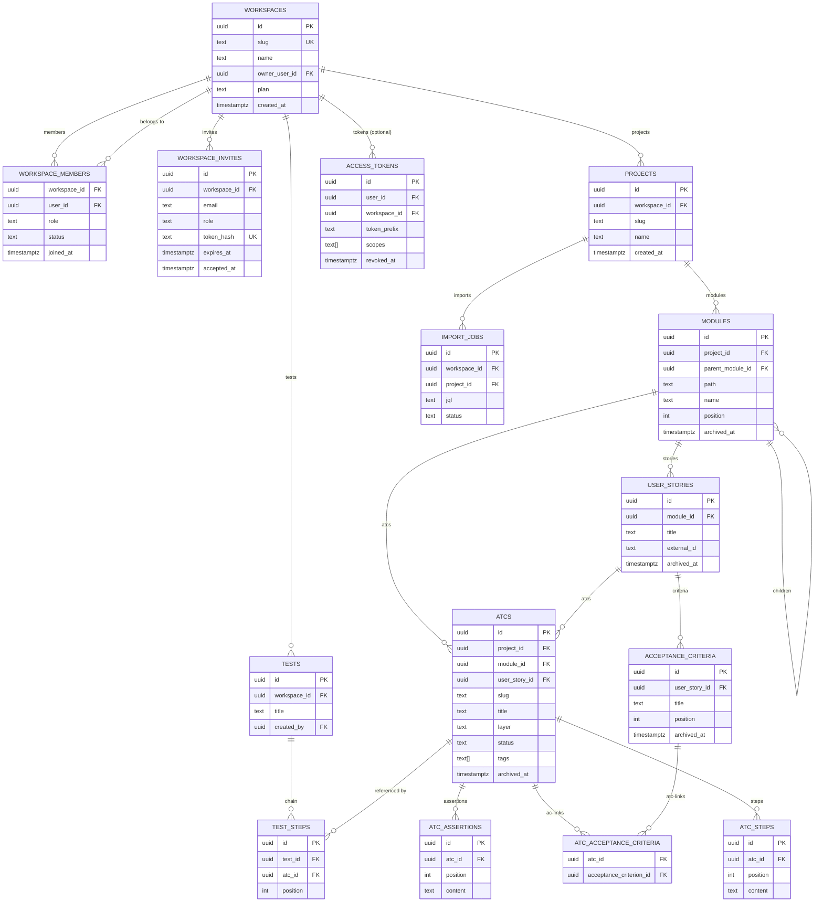
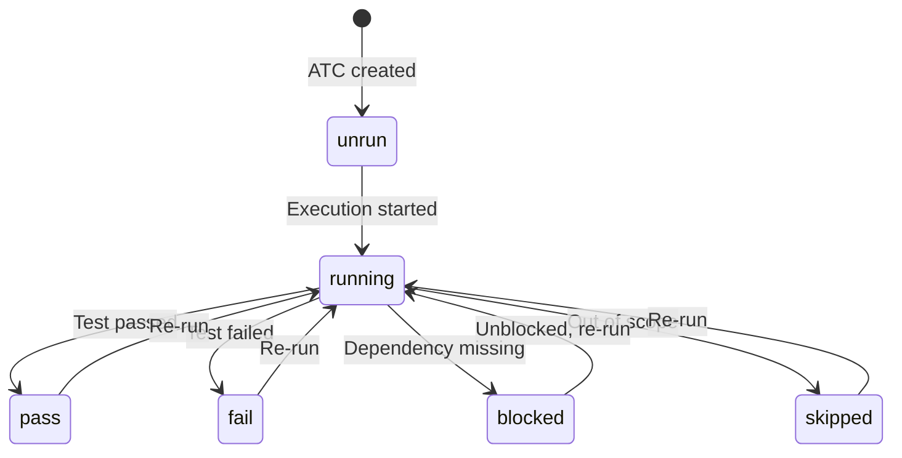
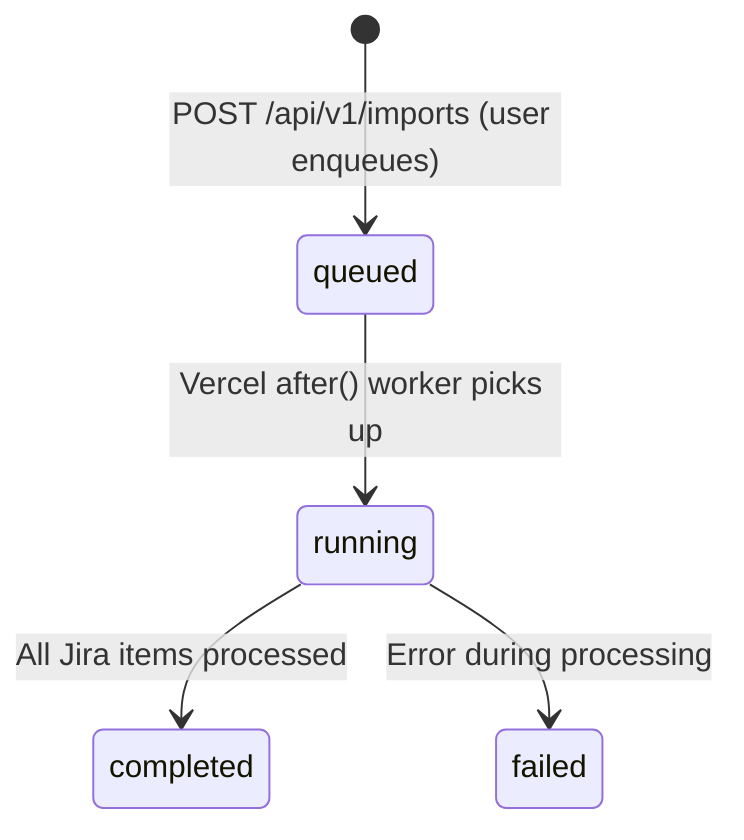
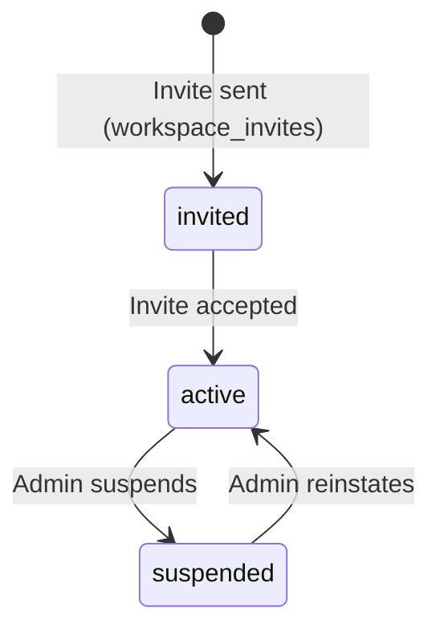
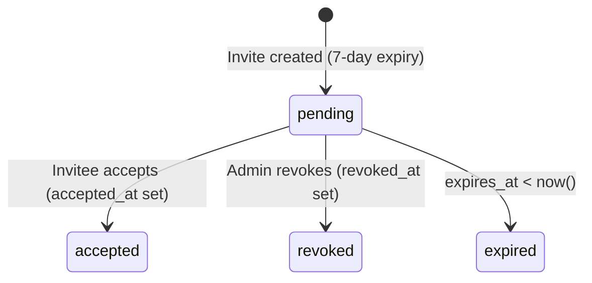

# Domain Glossary — Bunkai TMS

> Canonical domain terminology for QA automation and test documentation.
> Generated: 2026-06-23
> Source of truth: Supabase migration SQL files (`supabase/migrations/`). TypeScript validation schemas in `lib/` are secondary.

---

## 1. Core Entities

### Workspace

| Technical Name | Business Name | Description | Table/Collection | Key Attributes | Found In |
|---------------|---------------|-------------|-----------------|----------------|---------|
| `workspaces` | Workspace | The top-level multi-tenant boundary. Every user belongs to one or more Workspaces. A Workspace scopes all Projects, Members, Tests, and Tokens. | `public.workspaces` | `id`, `slug`, `name`, `owner_user_id`, `plan` (`community`/`cloud`/`enterprise`), `created_at` | `supabase/migrations/0001_tenancy.sql` line 27 |

**Relationships:**
- Has many `workspace_members` (RBAC)
- Has many `projects`
- Has many `access_tokens` (scoped or global)
- Has many `tests` (workspace-scoped)
- Has many `workspace_invites`

```json
{
  "id": "uuid",
  "slug": "my-team",
  "name": "My Team",
  "owner_user_id": "uuid",
  "plan": "community",
  "created_at": "2026-01-01T00:00:00Z"
}
```

---

### WorkspaceMember

| Technical Name | Business Name | Description | Table/Collection | Key Attributes | Found In |
|---------------|---------------|-------------|-----------------|----------------|---------|
| `workspace_members` | Workspace Member | RBAC join table. A user can have different roles in different Workspaces. | `public.workspace_members` | `workspace_id`, `user_id`, `role`, `status`, `joined_at` | `supabase/migrations/0001_tenancy.sql` line 40 |

**Relationships:**
- Belongs to `workspaces`
- Belongs to `auth.users` (Supabase Auth)

```json
{
  "workspace_id": "uuid",
  "user_id": "uuid",
  "role": "member",
  "status": "active",
  "joined_at": "2026-01-01T00:00:00Z"
}
```

---

### Project

| Technical Name | Business Name | Description | Table/Collection | Key Attributes | Found In |
|---------------|---------------|-------------|-----------------|----------------|---------|
| `projects` | Project | Represents the application under test (AUT). Scoped to one Workspace. | `public.projects` | `id`, `workspace_id`, `slug`, `name`, `description`, `created_at` | `supabase/migrations/0002_projects_modules.sql` line 17 |

**Relationships:**
- Belongs to `workspaces`
- Has many `modules`
- Has many `atcs` (via modules)

```json
{
  "id": "uuid",
  "workspace_id": "uuid",
  "slug": "my-app",
  "name": "My App",
  "description": "The app under test",
  "created_at": "2026-01-01T00:00:00Z"
}
```

---

### Module

| Technical Name | Business Name | Description | Table/Collection | Key Attributes | Found In |
|---------------|---------------|-------------|-----------------|----------------|---------|
| `modules` | Module | A node in the hierarchical test tree (max depth 6). Organizes User Stories. Self-referential via `parent_module_id`. Path is materialized (slash-separated) for efficient subtree queries. | `public.modules` | `id`, `project_id`, `parent_module_id`, `path`, `name`, `position`, `description`, `archived_at`, `created_at` | `supabase/migrations/0002_projects_modules.sql` line 109 |

**Relationships:**
- Belongs to `projects`
- Has many child `modules` (self-referential)
- Has many `user_stories`

```json
{
  "id": "uuid",
  "project_id": "uuid",
  "parent_module_id": null,
  "path": "auth/login",
  "name": "Login",
  "position": 0,
  "description": null,
  "archived_at": null,
  "created_at": "2026-01-01T00:00:00Z"
}
```

---

### UserStory

| Technical Name | Business Name | Description | Table/Collection | Key Attributes | Found In |
|---------------|---------------|-------------|-----------------|----------------|---------|
| `user_stories` | User Story | A unit of business intent anchored to a Module. May link to an external Jira issue via `external_id`/`external_url`. | `public.user_stories` | `id`, `module_id`, `title`, `description`, `external_id`, `external_url`, `archived_at`, `created_at` | `supabase/migrations/0003_authoring.sql` line 15 |

**Relationships:**
- Belongs to `modules`
- Has many `acceptance_criteria`
- Has many `atcs`

```json
{
  "id": "uuid",
  "module_id": "uuid",
  "title": "User can log in with magic link",
  "description": "As a user, I want to log in via email magic link.",
  "external_id": "BK-42",
  "external_url": "https://upexgalaxy69.atlassian.net/browse/BK-42",
  "archived_at": null,
  "created_at": "2026-01-01T00:00:00Z"
}
```

---

### AcceptanceCriterion

| Technical Name | Business Name | Description | Table/Collection | Key Attributes | Found In |
|---------------|---------------|-------------|-----------------|----------------|---------|
| `acceptance_criteria` | Acceptance Criterion (AC) | A single verifiable condition for a User Story. Sortable by `position`. Each ATC must reference at least one AC (the "anchoring moat"). | `public.acceptance_criteria` | `id`, `user_story_id`, `title`, `description`, `position`, `archived_at`, `created_at` | `supabase/migrations/0003_authoring.sql` line 122 |

**Relationships:**
- Belongs to `user_stories`
- Linked to `atcs` via `atc_acceptance_criteria` (M:N)

```json
{
  "id": "uuid",
  "user_story_id": "uuid",
  "title": "Given a valid email, a magic link is sent within 5 seconds",
  "description": null,
  "position": 0,
  "archived_at": null,
  "created_at": "2026-01-01T00:00:00Z"
}
```

---

### ATC (Acceptance Test Case)

| Technical Name | Business Name | Description | Table/Collection | Key Attributes | Found In |
|---------------|---------------|-------------|-----------------|----------------|---------|
| `atcs` | ATC / Acceptance Test Case | The core test artifact. Atomic test case with steps, assertions, tags, and a layer classification. Must reference ≥1 Acceptance Criterion. | `public.atcs` | `id`, `project_id`, `module_id`, `user_story_id`, `slug`, `title`, `layer`, `version`, `status`, `tags`, `tsv`, `archived_at`, `created_at`, `updated_at` | `supabase/migrations/0004_atcs.sql` line 53 |

**Relationships:**
- Belongs to `projects`
- Belongs to `modules`
- Belongs to `user_stories`
- Has many `atc_steps`
- Has many `atc_assertions`
- Linked to `acceptance_criteria` via `atc_acceptance_criteria`
- Referenced by `test_steps` (in Tests)

```json
{
  "id": "uuid",
  "project_id": "uuid",
  "module_id": "uuid",
  "user_story_id": "uuid",
  "slug": "tc-001-magic-link-happy-path",
  "title": "Magic link login — happy path",
  "layer": "UI",
  "version": 1,
  "status": "unrun",
  "tags": ["auth", "smoke"],
  "archived_at": null,
  "created_at": "2026-01-01T00:00:00Z",
  "updated_at": "2026-01-01T00:00:00Z"
}
```

---

### ATCStep

| Technical Name | Business Name | Description | Table/Collection | Key Attributes | Found In |
|---------------|---------------|-------------|-----------------|----------------|---------|
| `atc_steps` | ATC Step | An ordered action inside an ATC. Each step has a `content` (instruction), optional `input_data`, and optional `expected` result. | `public.atc_steps` | `id`, `atc_id`, `position`, `content`, `input_data`, `expected` | `supabase/migrations/0004_atcs.sql` line 179 |

**Relationships:**
- Belongs to `atcs`

---

### ATCAssertion

| Technical Name | Business Name | Description | Table/Collection | Key Attributes | Found In |
|---------------|---------------|-------------|-----------------|----------------|---------|
| `atc_assertions` | ATC Assertion | A verification statement attached to an ATC (post-condition check). | `public.atc_assertions` | `id`, `atc_id`, `position`, `content` | `supabase/migrations/0004_atcs.sql` line 285 |

**Relationships:**
- Belongs to `atcs`

---

### Test

| Technical Name | Business Name | Description | Table/Collection | Key Attributes | Found In |
|---------------|---------------|-------------|-----------------|----------------|---------|
| `tests` | Test | A workspace-scoped named container for an ordered chain of ATCs. Represents a full end-to-end flow. Created via `bunkai_create_test` RPC. | `public.tests` | `id`, `workspace_id`, `title`, `created_by`, `created_at`, `updated_at` | `supabase/migrations/0024_tests.sql` line 40 |

**Relationships:**
- Belongs to `workspaces`
- Belongs to `auth.users` (created_by)
- Has many `test_steps`

```json
{
  "id": "uuid",
  "workspace_id": "uuid",
  "title": "Full login and ATC creation flow",
  "created_by": "uuid",
  "created_at": "2026-01-01T00:00:00Z",
  "updated_at": "2026-01-01T00:00:00Z"
}
```

---

### TestStep

| Technical Name | Business Name | Description | Table/Collection | Key Attributes | Found In |
|---------------|---------------|-------------|-----------------|----------------|---------|
| `test_steps` | Test Step | A reference to an ATC at a specific position within a Test chain. The same ATC may appear multiple times (duplicates allowed — a chain is a sequence, not a set). | `public.test_steps` | `id`, `test_id`, `atc_id`, `position` | `supabase/migrations/0024_tests.sql` line 60 |

**Relationships:**
- Belongs to `tests`
- References `atcs` (ON DELETE RESTRICT)

---

### AccessToken (PAT)

| Technical Name | Business Name | Description | Table/Collection | Key Attributes | Found In |
|---------------|---------------|-------------|-----------------|----------------|---------|
| `access_tokens` | Personal Access Token (PAT) | Issued by users for CLI/AI-agent API access. Format: `bk_pat_<prefix>.<secret>`. Only the SHA-256 hash stored. Revoked via `revoked_at` (no DELETE). | `public.access_tokens` | `id`, `user_id`, `workspace_id`, `name`, `token_prefix`, `hash`, `scopes`, `expires_at`, `revoked_at`, `last_used_at`, `created_at` | `supabase/migrations/0008_access_tokens.sql` line 21 |

---

### WorkspaceInvite

| Technical Name | Business Name | Description | Table/Collection | Key Attributes | Found In |
|---------------|---------------|-------------|-----------------|----------------|---------|
| `workspace_invites` | Workspace Invite | Allows an admin/owner to invite a user by email + role. Token is hashed (raw returned once). Expires in 7 days. | `public.workspace_invites` | `id`, `workspace_id`, `email`, `role`, `token_hash`, `invited_by_user_id`, `expires_at`, `accepted_at`, `revoked_at` | `supabase/migrations/0010_workspace_invites.sql` line 13 |

---

### ImportJob

| Technical Name | Business Name | Description | Table/Collection | Key Attributes | Found In |
|---------------|---------------|-------------|-----------------|----------------|---------|
| `import_jobs` | Jira Import Job | Async one-way Jira import task. Enqueued by users, processed by Vercel `after()` worker. At most one active job per project. | `public.import_jobs` | `id`, `workspace_id`, `project_id`, `jql`, `status`, `imported_count`, `created_count`, `updated_count`, `skipped_count`, `errors`, `started_at`, `completed_at`, `created_at` | `supabase/migrations/0019_import_jobs.sql` line 10 |

---

## 2. Enumerations and Constants

### workspace.plan

| Value | Business Meaning | Usage Context | Found In |
|-------|-----------------|---------------|---------|
| `community` | Free tier (default) | Assigned on workspace creation | `supabase/migrations/0001_tenancy.sql` line 32 |
| `cloud` | Paid cloud tier | Unknown gating logic (not implemented) | `supabase/migrations/0001_tenancy.sql` line 32 |
| `enterprise` | Enterprise tier | Unknown gating logic (not implemented) | `supabase/migrations/0001_tenancy.sql` line 32 |

### workspace_members.role

| Value | Business Meaning | Usage Context | Found In |
|-------|-----------------|---------------|---------|
| `viewer` | Read-only access | Can SELECT; cannot mutate any table | `supabase/migrations/0001_tenancy.sql` line 43 |
| `member` | Standard contributor | Can read + write Projects, Modules, Stories, ATCs | `supabase/migrations/0001_tenancy.sql` line 43 |
| `admin` | Workspace administrator | All member rights + invite/manage members, workspace settings | `supabase/migrations/0001_tenancy.sql` line 43 |
| `owner` | Workspace owner | All admin rights + workspace DELETE | `supabase/migrations/0001_tenancy.sql` line 43 |

### workspace_members.status

| Value | Business Meaning | Usage Context | Found In |
|-------|-----------------|---------------|---------|
| `active` | Member is active | Required for any data access (RLS checks `status = 'active'`) | `supabase/migrations/0001_tenancy.sql` line 48 |
| `invited` | Invite sent, not yet accepted | Intermediate state from `workspace_invites` accept flow | `supabase/migrations/0001_tenancy.sql` line 48 |
| `suspended` | Access suspended | Admin action; RLS denies access | `supabase/migrations/0001_tenancy.sql` line 48 |

### atcs.layer

| Value | Business Meaning | Usage Context | Found In |
|-------|-----------------|---------------|---------|
| `UI` | User Interface / End-to-End test | Browser-driven, Playwright-style | `supabase/migrations/0004_atcs.sql` line 60; `lib/atcs/validation.ts` line 9 |
| `API` | REST API test | HTTP-level, no browser | `supabase/migrations/0004_atcs.sql` line 60 |
| `Unit` | Unit / integration test | Code-level | `supabase/migrations/0004_atcs.sql` line 60 |

### atcs.status

| Value | Business Meaning | Usage Context | Found In |
|-------|-----------------|---------------|---------|
| `unrun` | Not yet executed (default) | Initial state on ATC creation | `supabase/migrations/0004_atcs.sql` line 62 |
| `pass` | Last execution passed | Positive result | `supabase/migrations/0004_atcs.sql` line 62 |
| `fail` | Last execution failed | Negative result — defect found | `supabase/migrations/0004_atcs.sql` line 62 |
| `blocked` | Cannot execute (dependency missing) | Execution stopped externally | `supabase/migrations/0004_atcs.sql` line 62 |
| `skipped` | Intentionally not executed | Out of scope for current run | `supabase/migrations/0004_atcs.sql` line 62 |
| `running` | Currently executing | In-progress state | `supabase/migrations/0004_atcs.sql` line 62 |

### access_tokens.scopes (PAT)

| Value | Business Meaning | Usage Context | Found In |
|-------|-----------------|---------------|---------|
| `atc:read` | Read ATCs via API | CLI tools reading test cases | `supabase/migrations/0008_access_tokens.sql` line 35 |
| `atc:write` | Create/update ATCs via API | AI agents authoring test cases | `supabase/migrations/0008_access_tokens.sql` line 35 |
| `run:execute` | Execute/report test runs via API | CI/CD test runners | `supabase/migrations/0008_access_tokens.sql` line 35 |
| `workspace:admin` | Workspace administrative operations | Admin automation | `supabase/migrations/0008_access_tokens.sql` line 35 |

### import_jobs.status

| Value | Business Meaning | Usage Context | Found In |
|-------|-----------------|---------------|---------|
| `queued` | Enqueued, not yet picked up | Default on INSERT | `supabase/migrations/0019_import_jobs.sql` line 16 |
| `running` | Worker is processing | Set by Vercel `after()` worker | `supabase/migrations/0019_import_jobs.sql` line 16 |
| `completed` | Import finished successfully | Terminal success state | `supabase/migrations/0019_import_jobs.sql` line 16 |
| `failed` | Import finished with error | Terminal failure state | `supabase/migrations/0019_import_jobs.sql` line 16 |

---

## 3. Business Rules

### BR-001: ATC Anchoring Moat

- **Description**: Every ATC must reference at least one Acceptance Criterion. An ATC with zero AC links is invalid.
- **Entities Affected**: `atcs`, `acceptance_criteria`, `atc_acceptance_criteria`
- **Validation**: Application layer (`lib/atcs/builder-guards.ts`); enforced structurally via M:N join table
- **Error Code**: `validation_failed` (422) when `acceptance_criterion_ids` is empty in POST body
- **Found In**: `supabase/migrations/0004_atcs.sql` lines 2–10; `lib/atcs/validation.ts` line 41
- **Example**:
  ```
  Given: A user submits POST /api/v1/atcs
  When: The body includes an empty `acceptance_criterion_ids: []`
  Then: The API returns 422 with `{"error": {"code": "validation_failed"}}`
  ```

### BR-002: Module Depth Limit (Max 6)

- **Description**: Module tree depth cannot exceed 6 levels. Checked via path segment count.
- **Entities Affected**: `modules`
- **Validation**: DB CHECK constraint on `modules.path` + `bunkai_move_module` RPC depth check
- **Error Code**: `depth_exceeded` (45002 pg error code) on move; CHECK constraint violation on insert
- **Found In**: `supabase/migrations/0002_projects_modules.sql` lines 118–121; `supabase/migrations/0023_module_activity_log.sql` lines 186–200
- **Example**:
  ```
  Given: A module at depth 6 exists
  When: A user tries to create a child module under it
  Then: The DB CHECK constraint rejects the INSERT
  ```

### BR-003: At-Most-One Active Import Job Per Project

- **Description**: Only one import job in `queued` or `running` status per project is allowed.
- **Entities Affected**: `import_jobs`
- **Validation**: Partial unique index `import_jobs_project_active_idx` on `(project_id) WHERE status IN ('queued','running')`
- **Error Code**: Postgres unique violation (23505) → API `conflict` (409)
- **Found In**: `supabase/migrations/0019_import_jobs.sql` lines 33–36; `supabase/migrations/0020_import_jobs_one_active.sql`

### BR-004: ATC Step Positions Must Be Strictly Increasing From 1

- **Description**: ATC step positions must be integers, strictly increasing, starting at 1. Gaps are allowed (e.g. `[1, 2, 5]`).
- **Entities Affected**: `atc_steps`
- **Validation**: Application layer in `lib/atcs/validation.ts` `stepPositionsError()`
- **Error Code**: `steps_position_invalid` (422) with offending positions list
- **Found In**: `lib/atcs/validation.ts` lines 63–76

### BR-005: ATC Cross-Workspace Reference Prohibited (INV-3)

- **Description**: A Test chain cannot reference ATCs from a different workspace. Foreign-workspace and nonexistent ATC IDs produce the same uniform error (non-disclosure).
- **Entities Affected**: `test_steps`, `atcs`, `tests`
- **Validation**: `bunkai_create_test` RPC step 4; RLS policy on `test_steps` also enforces at DB layer
- **Error Code**: `atc_not_in_workspace` (45122 pg code) → `validation_failed` in API
- **Found In**: `supabase/migrations/0024_tests.sql` lines 206–224

### BR-006: PAT Revocation Is Soft (No DELETE)

- **Description**: Tokens are never deleted. Revocation sets `revoked_at` timestamp. The bearer middleware rejects rows with `revoked_at IS NOT NULL` or `expires_at < now()`.
- **Entities Affected**: `access_tokens`
- **Validation**: No DELETE RLS policy on `access_tokens` table; application middleware check
- **Found In**: `supabase/migrations/0008_access_tokens.sql` lines 11–17; `lib/api/middleware/bearer.ts`

### BR-007: Workspace Invite Expires After 7 Days

- **Description**: A workspace invite is valid for 7 days from creation. The accept endpoint must reject expired invites.
- **Entities Affected**: `workspace_invites`
- **Validation**: `expires_at` default `now() + interval '7 days'`; application route checks expiry
- **Found In**: `supabase/migrations/0010_workspace_invites.sql` line 23

---

## 4. Entity Relationships Diagram



---

## 5. Terminology Mapping

### Technical → Business Terms

| Technical Term | Business Term | Notes |
|---------------|--------------|-------|
| `workspaces` | Workspace / Tenant | Top-level isolation boundary |
| `workspace_members` | Team Member | Includes role + status |
| `projects` | Project / Application Under Test | The system being tested |
| `modules` | Module / Test Folder | Hierarchical; max depth 6 |
| `user_stories` | User Story | Business feature unit; may link to Jira |
| `acceptance_criteria` | Acceptance Criterion (AC) | Verifiable story condition |
| `atcs` | ATC (Acceptance Test Case) | Atomic test case |
| `atc_steps` | Test Step | Action in an ATC |
| `atc_assertions` | Test Assertion | Post-condition check |
| `atc_acceptance_criteria` | AC Link / Anchoring | M:N traceability |
| `tests` | Test (capital T) / Test Suite | Ordered ATC chain |
| `test_steps` | Chain Step | ATC reference within a Test |
| `access_tokens` | PAT (Personal Access Token) | Machine-readable API key |
| `import_jobs` | Jira Import Job | Async Jira story import |
| `activity_log` | Audit Log | Workspace event trail |
| `feature_flags` | Feature Flag | Gradual rollout gate |
| `idempotency_keys` | Idempotency Key | POST replay protection |

### Abbreviations and Acronyms

| Abbreviation | Full Form | Context |
|-------------|----------|---------|
| ATC | Acceptance Test Case | Core test artifact in Bunkai |
| AC | Acceptance Criterion | Verifiable condition in a User Story |
| TMS | Test Management System | What Bunkai is |
| PAT | Personal Access Token | Machine API key format: `bk_pat_<prefix>.<secret>` |
| JQL | Jira Query Language | Used for Jira import filtering |
| RLS | Row-Level Security | Supabase PostgreSQL authorization mechanism |
| RBAC | Role-Based Access Control | workspace_members roles system |
| ADF | Atlassian Document Format | Jira rich-text format; converted to Markdown on import |
| INV-3 | Invariant 3 | Non-disclosure of cross-workspace resource existence |
| BK | Bunkai | Jira project key |
| SSR | Server-Side Rendering | Auth session refresh via `@supabase/ssr` |

---

## 6. Status / State Flows

### ATC Status Flow



Source: `supabase/migrations/0004_atcs.sql` line 62 (status CHECK constraint)

### Import Job Status Flow



Source: `supabase/migrations/0019_import_jobs.sql` line 16

### WorkspaceMember Status Flow



Source: `supabase/migrations/0001_tenancy.sql` line 48; `supabase/migrations/0010_workspace_invites.sql`

### Workspace Invite Status Flow



Source: `supabase/migrations/0010_workspace_invites.sql` lines 23, 29, 33

---

## 7. UI Labels Reference

> No i18n files found in this project. Labels extracted from component JSX + route names.

### Form Field Labels

| Field | UI Label (inferred from component) | Entity | Found In |
|------|------------------------------------|--------|---------|
| `name` (workspace) | Workspace name | `workspaces` | `app/(app)/onboarding/onboarding-form.tsx` |
| `title` (ATC) | Title (3–200 chars) | `atcs` | `lib/atcs/validation.ts` line 16–17 |
| `layer` | Layer (UI / API / Unit) | `atcs` | `lib/atcs/validation.ts` line 9 |
| `tags` | Tags (max 10) | `atcs` | `lib/atcs/validation.ts` line 17 |
| `content` (step) | Step content (max 2048 bytes) | `atc_steps` | `lib/atcs/validation.ts` line 14 |
| `input_data` (step) | Input data | `atc_steps` | `lib/atcs/validation.ts` line 25 |
| `expected` (step) | Expected result | `atc_steps` | `lib/atcs/validation.ts` line 26 |
| `jql` | JQL query | `import_jobs` | `app/(app)/projects/[projectSlug]/import-from-jira-dialog.tsx` |
| `title` (Test) | Test title (1–200 chars, trimmed) | `tests` | `supabase/migrations/0024_tests.sql` line 45 |

### Action Buttons / Route Labels

| Route / Component | UI Action | Entity |
|------------------|-----------|--------|
| `app/(app)/projects/create-project-form.tsx` | Create Project | `projects` |
| `app/(app)/projects/[projectSlug]/atcs/new/` | New ATC | `atcs` |
| `app/(app)/projects/[projectSlug]/tests/new/` | New Test | `tests` |
| `app/(app)/projects/[projectSlug]/delete-module-dialog.tsx` | Delete Module | `modules` |
| `app/(app)/projects/[projectSlug]/move-module-dialog.tsx` | Move Module | `modules` |
| `app/(app)/projects/[projectSlug]/rename-module-form.tsx` | Rename Module | `modules` |
| `app/(app)/projects/[projectSlug]/import-from-jira-dialog.tsx` | Import from Jira | `import_jobs` |
| `app/(app)/workspaces/[id]/members/` | Members | `workspace_members` |
| `app/(auth)/login/` | Sign In (magic link) | Auth |

---

## 8. Discovery Gaps

- **Module `archived_at` column**: Referenced in migration SQL (0023) but not defined in 0002 migration — likely added in 0014 `0014_module_soft_delete.sql` (not read). Assumed present based on usage evidence.
- **`user_stories.archived_at`**: Referenced in 0023 soft-delete logic but not in 0003 original migration — likely from a later migration.
- **`acceptance_criteria.archived_at`**: Same as above.
- **`atcs.archived_at`**: Referenced in 0024 but not in 0004 — likely from a later migration.
- **i18n**: No `public/locales/` or `lib/i18n/` directory found — labels derived from component JSX (less authoritative than i18n files).
- **`lib/supabase-types.ts`** (generated): Not committed in repo snapshot — full TypeScript type definitions for all tables unavailable.
- **Plan tier gating logic**: `community`/`cloud`/`enterprise` schema values exist but no application code gates features per plan.
- **`activity_log` event catalog** (`.context/business/events.md`): Referenced in 0023 but file not found in target repo.

---

## 9. QA Usage Guide

**How to use this glossary when writing test cases:**

1. **Entity names**: Always use the technical name (`atcs`, not "test cases") when referencing DB tables in defect reports. Use the business name ("ATC", "User Story", "Acceptance Criterion") in test titles and Jira story descriptions.

2. **Enumerations**: Use the exact enum value from this glossary as test data. Example: ATC layer must be one of `UI`, `API`, `Unit` — not `"ui"` or `"ui-test"`.

3. **State transitions**: The ATC status flow defines valid transition paths. Test invalid transitions (e.g., can `unrun` jump directly to `pass`? — NO, it must go through `running`).

4. **RBAC testing**: The role/status matrix is the authority for permission testing. Always test with `viewer` role to confirm read-only; test mutations with `member`, `admin`, and `owner` separately.

5. **Error codes**: The `lib/api/error-envelope.ts` `API_ERROR_CODES` list is the contract for error response testing. Assert on `error.code` (e.g., `"steps_position_invalid"`), not on `error.message` (which can change).

6. **Business rules**: Each BR in section 3 has a direct test implication. Every BR should have at least one negative test case (what happens when the rule is violated).

7. **INV-3 non-disclosure**: When testing cross-workspace ATC references, the error response must NOT reveal whether the ATC ID exists in another workspace — only that it "is not in workspace". Verify the error code is `validation_failed`, not `not_found`.
